# EdgeTX MT12 Config Editor — User Manual

A browser-based editor for creating and managing EdgeTX model configuration files on the Radiomaster MT12 surface transmitter.

---

## Table of Contents

1. [Getting Started](#1-getting-started)
2. [The Model List](#2-the-model-list)
3. [Basic View](#3-basic-view)
4. [Setup Wizard](#4-setup-wizard)
5. [KidControl Wizard](#5-kidcontrol-wizard)
6. [Advanced View — Module](#6-advanced-view--module)
7. [Advanced View — Timers](#7-advanced-view--timers)
8. [Advanced View — Drive Modes](#8-advanced-view--drive-modes)
9. [Advanced View — Mixes](#9-advanced-view--mixes)
10. [Advanced View — Expos](#10-advanced-view--expos)
11. [Advanced View — Limits](#11-advanced-view--limits)
12. [Advanced View — Logical Switches](#12-advanced-view--logical-switches)
13. [Advanced View — Special Functions](#13-advanced-view--special-functions)
14. [Advanced View — KidControl Tab](#14-advanced-view--kidcontrol-tab)
15. [Transmitter Settings](#15-transmitter-settings)
16. [Vehicle Types](#16-vehicle-types)
17. [Saving & Backup](#17-saving--backup)
18. [Help & About](#18-help--about)

---

## 1. Getting Started

### Browser requirements

The app uses the browser [File System Access API](https://developer.mozilla.org/en-US/docs/Web/API/File_System_API) to read and write directly to your MT12's SD card. This requires:

- **Chrome 86+ or Edge 86+** for full SD card access
- Firefox and Safari work but fall back to downloading YAML files instead of writing directly to the card

### Connecting your SD card

1. Insert your MT12's SD card into your computer's card reader (or connect the MT12 via USB in mass storage mode)
2. Open the app in Chrome or Edge
3. Click **Connect SD card** in the top-right corner of the header
4. When the browser asks you to pick a folder, select the **root of the SD card** (the folder that contains `MODELS/`, `RADIO/`, `BACKUP/`)
5. The red dot in the header turns green and the model list populates

### Offline mode (no SD card)

You can use the app without an SD card. A banner at the top of the model list explains that any **Save** will download the YAML file to your computer instead of writing to the card.

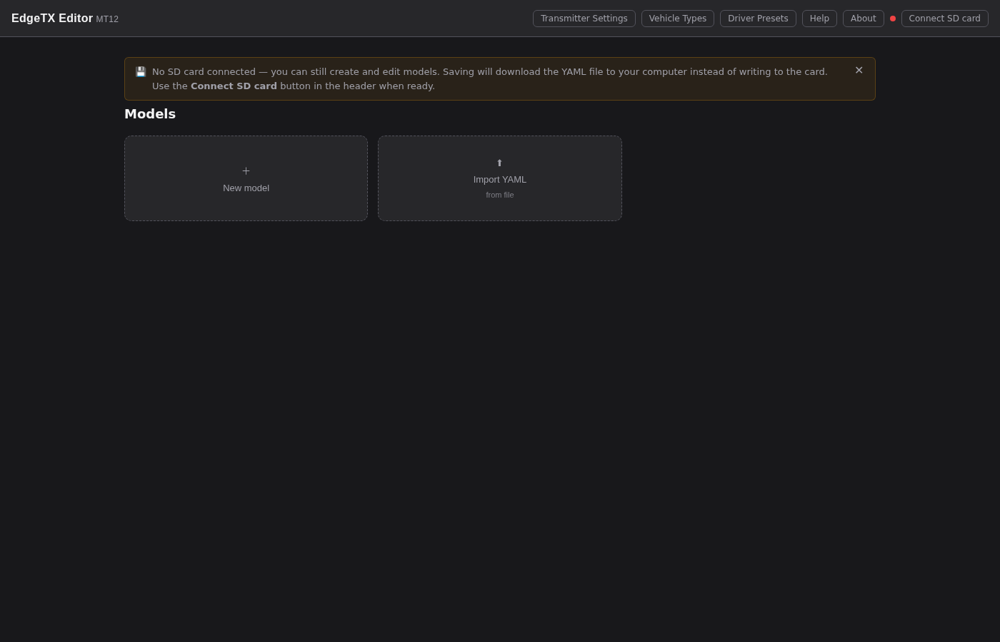

### Demo mode

Append `?demo` to the URL to load a virtual in-memory SD card pre-populated with sample models. Changes are not persisted to disk — use the **Download SD card ↓** button in the demo banner to export the result as a ZIP file.

### Header and status indicators

The header shows the current SD card connection state on the right:

- **Red dot** — no SD card connected. Click **Connect SD card** to connect.
- **Green dot + "SD card connected"** — a real SD card is active. A **Disconnect** button appears to release it without refreshing the page.
- **Green dot + "Demo loaded"** — demo mode is active.

When demo mode is active, a coloured banner appears above the header with the text "Demo mode — changes are in-memory only and will be lost on refresh." A **Download SD card ↓** button in that banner exports the current in-memory card as a ZIP file.

**Error banner (red)** — appears below the header when a file operation fails. Click **Dismiss** to clear it.

**Warnings banner (yellow)** — appears below the header (below any error) when model files were skipped during load (e.g. unreadable YAML). Each warning names the affected file. Click **Dismiss** to clear all warnings.

---

## 2. The Model List

The model list is the home screen. It shows every model loaded from the SD card (or created in the current session).

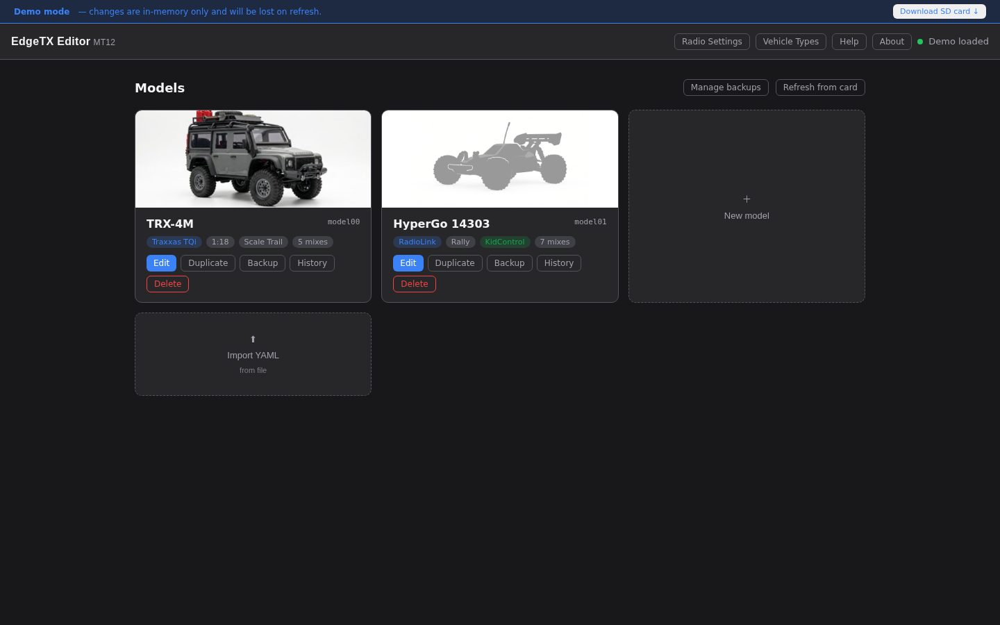

Each model card shows:

- **Model photo** (if one has been uploaded) — hover to zoom
- **Model name** and slot key (e.g. `model00`)
- **Protocol badge** — the RF protocol this model uses (e.g. Traxxas TQi, RadioLink)
- **Scale badge** — if a scale has been set (e.g. 1:18)
- **Vehicle type badge** — if a vehicle type has been assigned
- **Power source badge** (🔋 Electric / ⛽ Fuel) — shown when a power source has been set
- **KidControl badge** (green) — shown when KidControl is active on the model
- **Unsaved badge** (yellow) — shown when the model has changes not yet saved to the card
- **Mix count** — how many active mix lines the model contains
- **Edit**, **Duplicate**, **Backup**, **History**, **Delete** action buttons

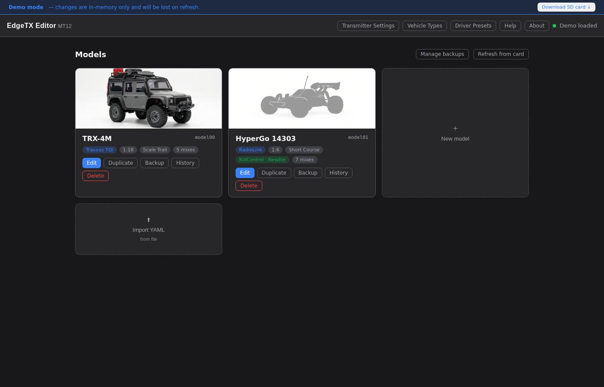

The **Backup** button (shown only when an SD card or demo is connected) immediately writes a timestamped backup to `BACKUP/`. The button briefly shows "Backed up!" to confirm.

The **History** button opens the backup browser for this model — see [Saving & Backup](#17-saving--backup).

### Changing a model's photo from the list

A pencil (✏) icon appears over the model photo on hover. Clicking it opens the image picker directly from the model list — you do not need to enter the editor. See [Setup Wizard Step 1](#step-1--vehicle) for image picker details.

### Toolbar actions

When an SD card (or demo) is connected, the toolbar shows:

- **Manage backups** — opens the all-models backup browser
- **Refresh from card** — reloads all model files from the SD card, discarding in-memory changes

> If any models have unsaved changes, a confirmation dialog asks whether to discard them before reloading.

### Creating a new model

Click the **＋ New model** card. A blank model is created in the next available slot and the editor opens immediately in Basic view, where the setup wizard guides you through the initial configuration.

### Importing an existing YAML file

Click the **⬆ Import YAML** card. A file picker opens — select any `.yml` or `.yaml` model file from your computer. The model is imported and opened in the editor.

### Deleting a model

Click **Delete** on a model card. A confirmation dialog appears before anything is removed.

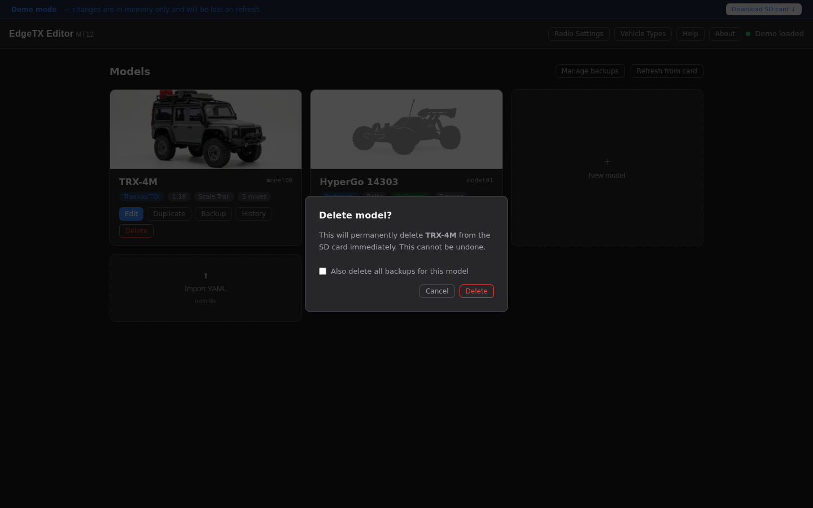

The dialog includes a checkbox to also delete all backups for the model. When an SD card is connected, deletion removes the file from the card immediately and cannot be undone.

---

## 3. Basic View

When you open a model the editor starts in **Basic** view — a simplified, task-oriented summary of the most commonly changed settings. Use the **Basic / Advanced** toggle in the top-right to switch views.

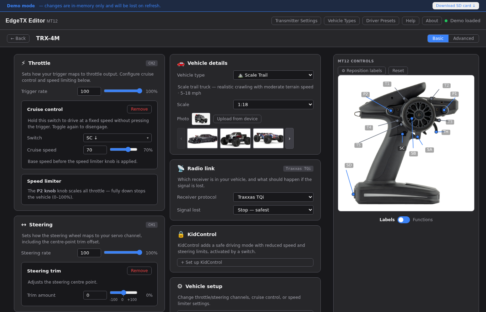

The basic view shows named cards on the left and the **MT12 Controls** diagram on the right.

### Throttle

Shows the throttle channel (e.g. CH2) and the current **Trigger rate** — the maximum throttle percentage. An optional **Cruise control** sub-card and **Speed limiter** sub-card appear if those features are configured.

- **Cruise control** — holds the current throttle without pressing the trigger. Configure the switch and cruise speed, or click **Remove** to delete it.
- **Speed limiter** — shows either the knob assignment (variable mode) or the switch/percentage (switch mode). Remove it via Advanced > Mixes.

### Steering

Shows the steering channel (e.g. CH1) and the current **Steering rate** (maximum servo travel). An optional **Steering trim** sub-card appears if a trim source is configured. Click **Remove** to delete the steering trim.

### Gyro gain

If a gyro gain channel is configured, a card shows which knob controls gyro sensitivity and which channel it sends on. Click **Remove** to delete it.

### Vehicle details

| Field | Description |
|-------|-------------|
| Vehicle type | Links this model to a [Vehicle Type](#16-vehicle-types), which provides KidControl presets |
| Scale | The 1:N scale of your vehicle (metadata only, stored on the SD card) |

### Radio link

Displays the current receiver protocol and the **Signal lost** (failsafe) behaviour. Edit these values directly from the dropdowns, or re-run the setup wizard for a guided flow.

### KidControl

Shows whether KidControl is active. If configured, displays the trigger switch, throttle limit, speed ramp, and steering limit settings, along with a **Re-run KidControl wizard** button. If not yet configured, shows a **+ Set up KidControl** button.

See [KidControl Wizard](#5-kidcontrol-wizard) for setup instructions.

### Vehicle setup

Click **⚙ Re-run setup wizard** to re-open the full setup wizard. All steps are pre-populated with the current model's values so you only need to change what you want.

### Unrecognised model

If the app cannot map a model's mix structure to the expected basic patterns (throttle, steering, gyro), the left panel shows an **Unrecognised model** notice instead of the usual cards. Use **Advanced** view to inspect and edit the mixes directly.

### The MT12 Controls diagram

The right panel shows a photo of the MT12 with your controls labelled. Toggle **Labels / Functions** at the bottom to switch between showing the assigned names and the EdgeTX function names (SA, SB, P1, etc.). Click **⚙ Reposition labels** to adjust label placement.

> **Note:** Label repositioning requires an SD card (or demo) to be connected. The button is disabled when no card is connected.

---

## 4. Setup Wizard

The setup wizard runs automatically when a new model is created, and can be re-run at any time via **⚙ Re-run setup wizard** in the Basic view. It walks through each major area in turn, pre-filling from the current model when re-running.

A breadcrumb at the top shows all steps: **Vehicle › Radio link › Throttle › Cruise › Speed limiter › Steering › Gyro › KidControl › Done**

### Step 1 — Vehicle

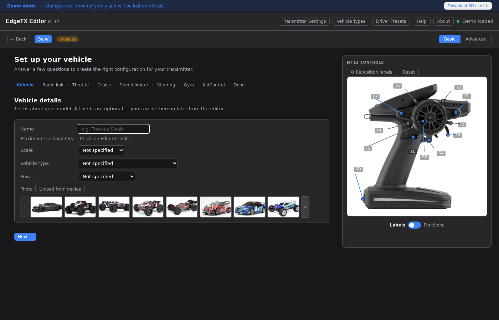

Set the model name (up to 15 characters), scale, vehicle type, power source (battery/fuel), and optionally upload a photo from your device or pick one from the **image library carousel**. The carousel shows all images found in `IMAGES/library/` on the SD card. Hover over a thumbnail to see a zoomed preview; click to select. Use the left/right arrows to scroll through the library. You can also upload a photo directly from your device using the upload button.

### Step 2 — Radio link

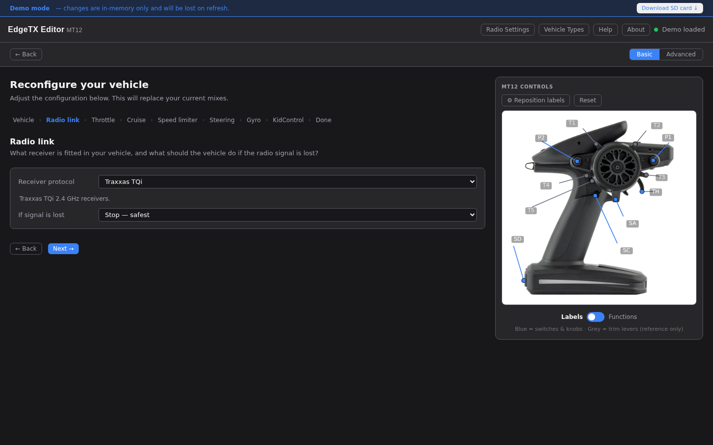

Choose the RF protocol that matches your receiver (e.g. Traxxas TQi, FlySky AFHDS2A, DSM/Spektrum) and what the vehicle should do if the signal is lost (Stop / Hold / Not set).

### Step 3 — Throttle

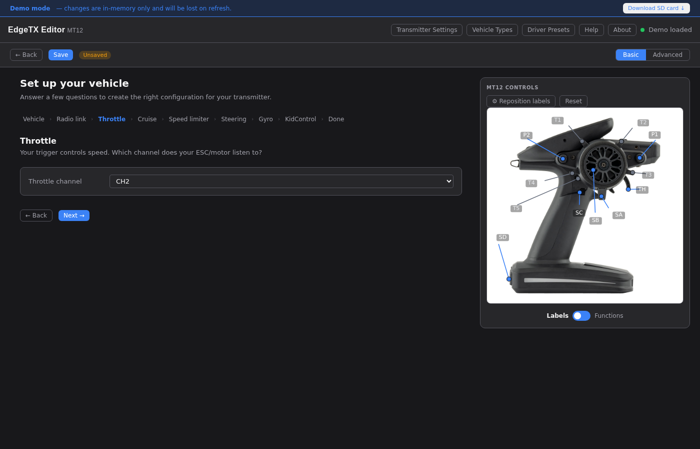

Select the output channel your ESC or motor controller listens on, and set the maximum trigger rate.

### Step 4 — Cruise control

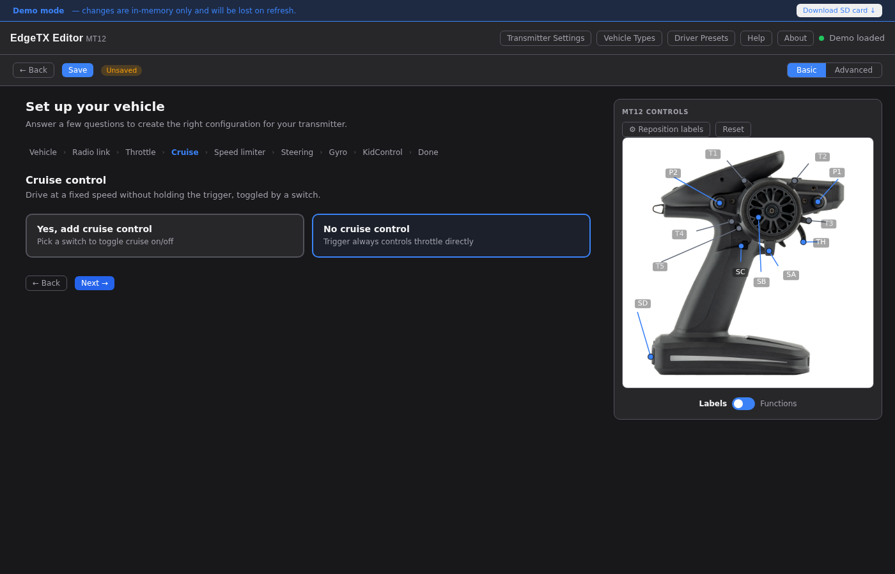

Optionally assign a switch for cruise-hold and set a default cruise speed. Disable with the **No cruise control** option.

### Step 5 — Speed limiter

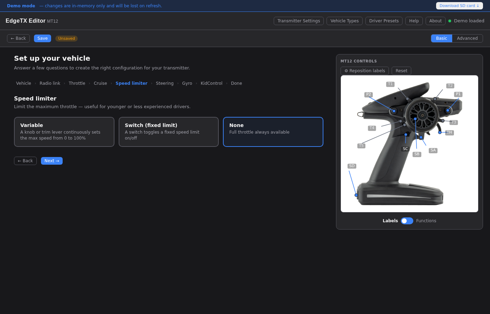

Choose how throttle is limited:

| Mode | Description |
|------|-------------|
| None | No speed limiter |
| Variable (knob) | A trim lever (T1–T5) or knob (P1/P2) scales throttle continuously. Fully down stops the vehicle |
| Switch | A switch position cuts throttle to a fixed percentage |

### Step 6 — Steering

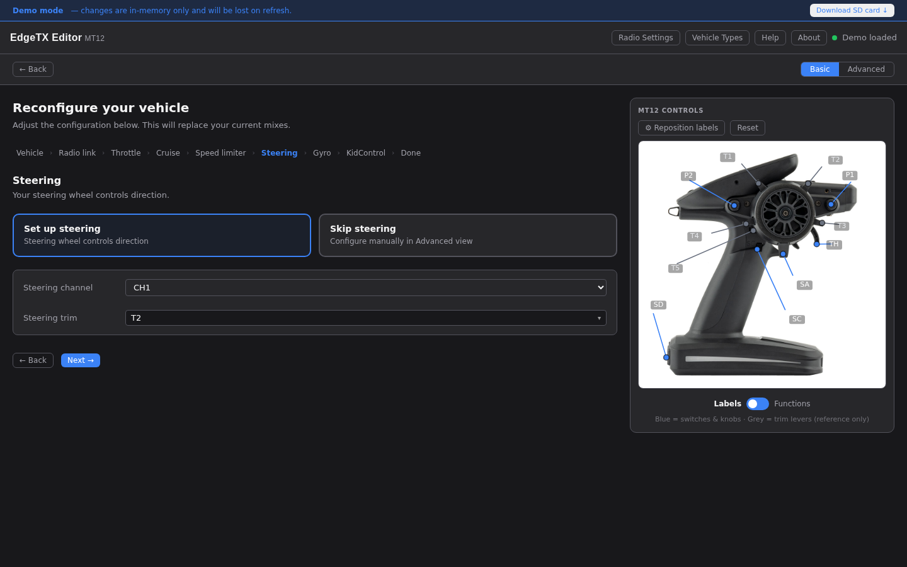

Select the steering channel, set the steering rate, and optionally assign a **steering trim** source (a trim lever or knob that adjusts the steering neutral point).

### Step 7 — Gyro gain

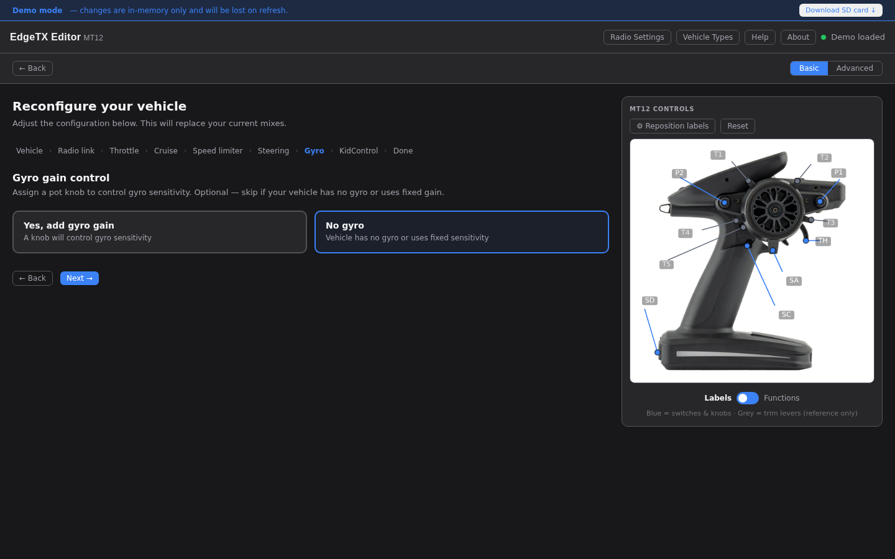

Optionally assign a trim lever (T1–T5) or knob to control gyro sensitivity on a dedicated channel.

### Step 8 — KidControl

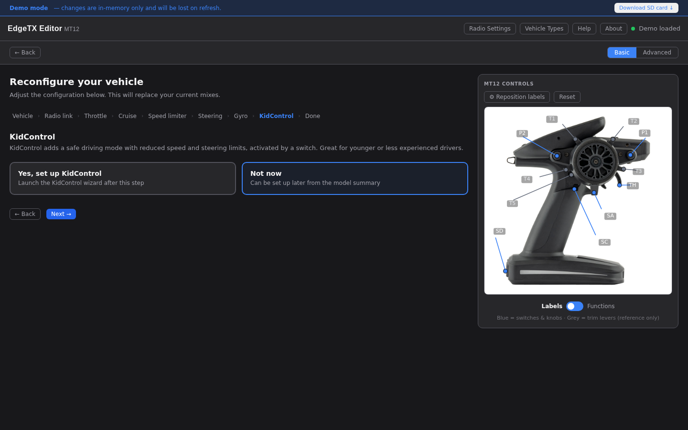

Optionally launch the [KidControl Wizard](#5-kidcontrol-wizard) as the final step.

### Step 9 — Done

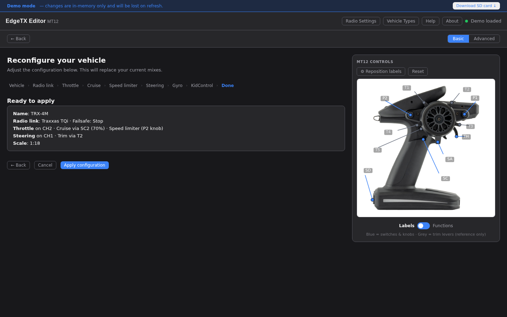

Review a summary of all settings and click **Apply** to generate the model's mix and expo lines. Click **Cancel** at any time to discard wizard changes and return to the editor.

---

## 5. KidControl Wizard

KidControl creates a safe driving profile activated by a physical switch. When the switch is engaged, reduced throttle and steering limits apply — flip it back for full control.

Open the wizard from:
- **Basic view** — click **+ Set up KidControl** in the KidControl card
- **Advanced view** — go to the **KidControl** tab (the wizard appears automatically when KidControl isn't yet configured)

### Step 1 — Vehicle type

> **This step is skipped automatically** if the model already has a vehicle type set. The wizard jumps straight to step 2 using the saved type.

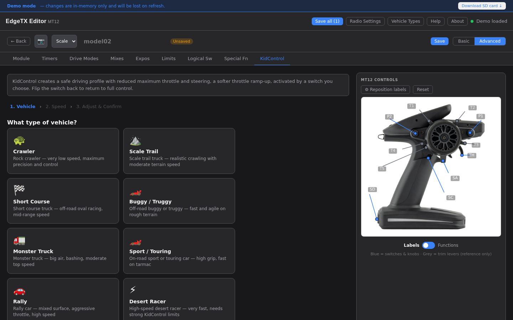

Shows the full list of vehicle categories from your [Vehicle Types](#16-vehicle-types) page. Each category maps to a KidControl preset (Crawler, Sport, Rally, or High-speed) that provides default throttle and steering limits. Clicking a category advances immediately to step 2.

### Step 2 — Speed class

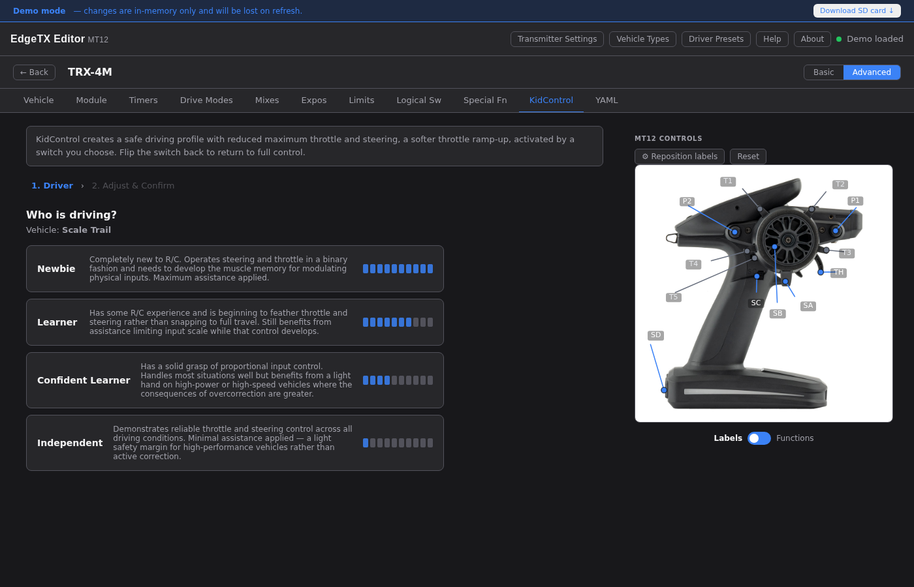

Choose how conservative the limits should be:

| Option | Description |
|--------|-------------|
| Slow | Very conservative — for young or first-time drivers |
| Medium | Balanced — comfortable limits for most kids |
| Fast | Light limits — for older or experienced kids |

Clicking a speed class advances immediately to step 3 with pre-filled values based on the vehicle category and speed class combination.

### Step 3 — Adjust & Confirm

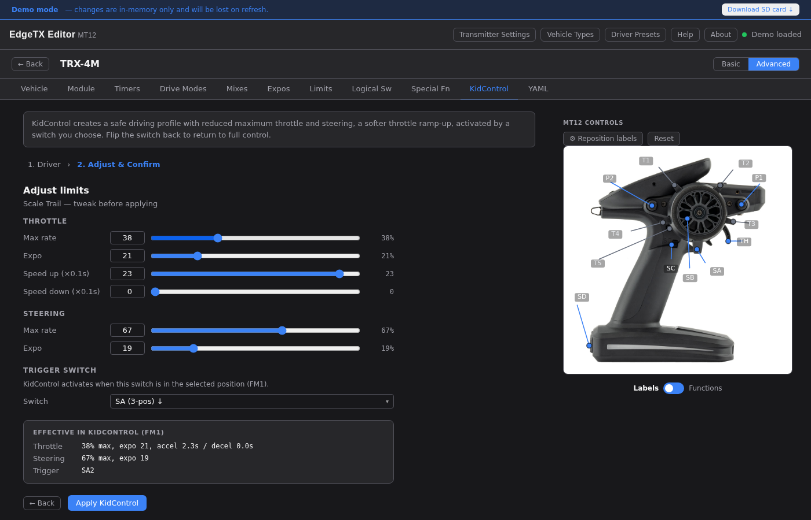

All derived parameters are presented as adjustable sliders:

| Parameter | What it controls |
|-----------|-----------------|
| Throttle — Max rate | Maximum throttle as a percentage of full power |
| Throttle — Expo | How soft the centre of the trigger feels |
| Speed up (×0.1s) | How many tenths of a second to reach full throttle |
| Speed down (×0.1s) | How many tenths of a second to release throttle fully |
| Steering — Max rate | Maximum steering servo travel as a percentage |
| Steering — Expo | How soft the steering feels near centre |

A **Trigger switch** picker at the bottom sets which switch activates KidControl (defaults to SA2).

A live **Effective in KidControl (FM1)** summary shows the final values before you commit.

Click **Apply KidControl** to write the configuration to the model. Click **← Back** to return to the speed class selection without changing anything.

### KidControl active state

Once applied, both the Basic view and the Advanced KidControl tab show a summary of the active settings.

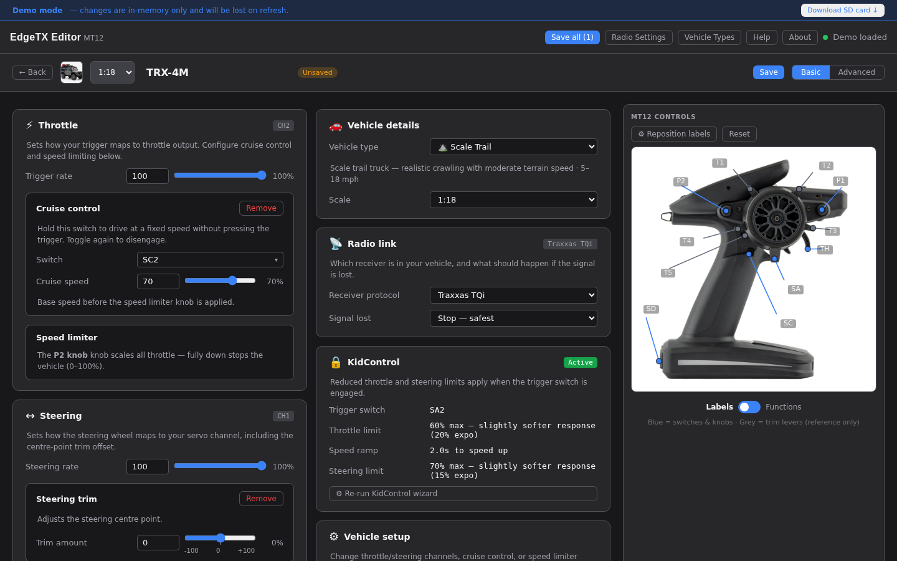

The summary shows the trigger switch, throttle limit and expo, speed ramp values, and steering limit and expo. A **Re-run KidControl wizard** button lets you reconfigure, and a **Remove KidControl** button deletes the FM1 drive mode and all associated KidControl mix/expo lines.

---

## 6. Advanced View — Module

Switch to **Advanced** view using the toggle in the top-right of the model editor. The editor shows a row of tabs; the default is **Module**.

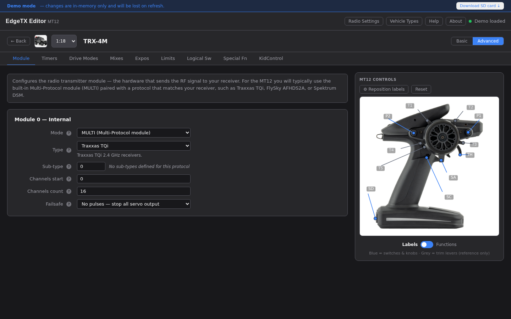

The Module tab configures the RF hardware that sends the signal to your receiver.

### Internal module (slot 0)

| Setting | Description |
|---------|-------------|
| Mode | TYPE_MULTIMODULE for the built-in multi-protocol module |
| Type (protocol) | Must match your receiver. Common surface choices: Traxxas TQi, Traxxas TQ Gen2, DSM/Spektrum, FlySky AFHDS2A, RadioLink |
| Channels | How many channels to transmit (typically 16) |
| Failsafe mode | What the receiver does when signal is lost: No pulses (stop), Hold last position, or Not set |
| RX number | Receiver binding number — increment when binding a new receiver |

### External module (slot 1)

The MT12 has an external module bay (SMA connector). Configure a second RF module here if fitted.

---

## 7. Advanced View — Timers

The MT12 supports up to three independent timers. Each can be configured with:

| Setting | Description |
|---------|-------------|
| Mode | Off, absolute (counts up), countdown, countdown with beep |
| Name | Short label shown on the transmitter screen |
| Start time | For countdown timers: the time to count down from |
| Switch | Pause/resume the timer (leave blank to run always) |
| Minute beep | Beep every minute |
| Countdown beep | Beep in the last 30/20/10 seconds |
| Persistent | Remember the timer value across power cycles |

Timers are useful for tracking battery run time, session duration, or enforcing driving time limits.

---

## 8. Advanced View — Drive Modes

Drive modes (called *flight modes* in EdgeTX) let you switch between different sets of channel behaviour using a physical switch. **FM0 is always the default** and is always active when no other mode is engaged.

Each mode has:

| Setting | Description |
|---------|-------------|
| Name | Short label (up to 10 characters) |
| Switch | Which switch activates this mode (leave blank for FM0) |
| Fade in / out | How many tenths of a second to crossfade into/out of this mode |
| Trims | Per-trim override: use own trim, use FM0's trim, or disable |

> **KidControl uses FM1.** When the KidControl switch is engaged, FM1 activates and the KidControl expo and mix lines take effect.

---

## 9. Advanced View — Mixes

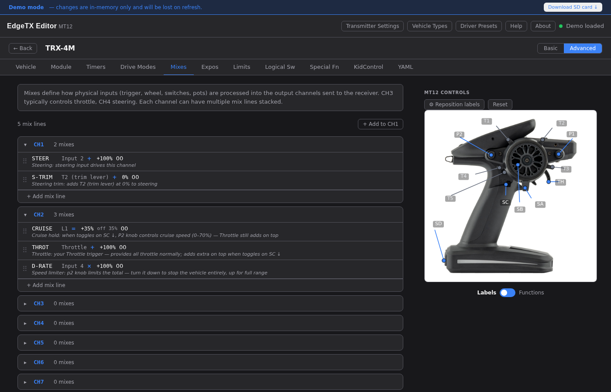

Mixes define how physical inputs are processed into the output channels sent to your receiver. Channels are grouped, and each group shows all mix lines with their source, weight, and a human-readable description.

- **CH1** typically controls steering
- **CH2** typically controls throttle

### Adding a mix line

Click **＋ Add to CHn** inside a channel group to add a new mix line.

### Editing a mix line

Click any mix line row to open the edit form:

| Parameter | Description |
|-----------|-------------|
| Source | Physical input (trigger, wheel, switch, pot, other channel, etc.) |
| Weight | How much of the source is mixed in (positive = same direction, negative = inverted) |
| Offset | A constant offset added to the output |
| Mode | Multiply / Replace / Add — how this line combines with others on the same channel |
| Switch | Only apply this mix when this switch is active |
| Flight modes | Which drive modes this mix is active in |
| Speed up / down | Ramp rate in tenths of a second |
| Delay up / down | Activation delay in tenths of a second |
| Name | Optional label (shown in the mix list) |

### Reordering mix lines

Drag a mix line by its handle to reorder it within a channel group. Order matters when mode is **Add** or **Multiply** — lines are applied top to bottom.

---

## 10. Advanced View — Expos

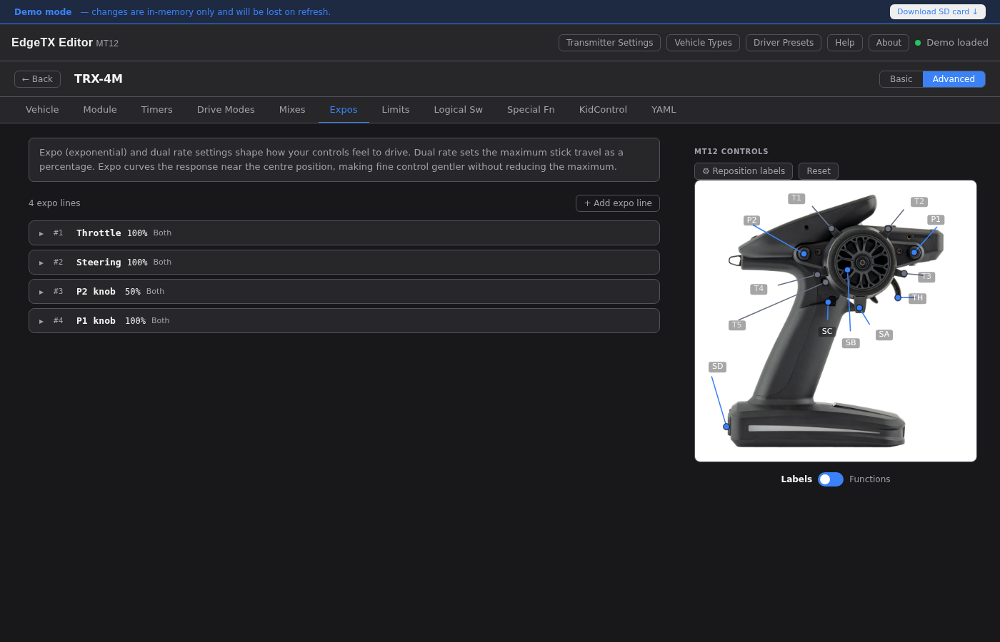

Expo (exponential) and dual rate lines shape how physical inputs feel to drive, without changing the maximum output.

| Parameter | Description |
|-----------|-------------|
| Channel | The input to shape (steering, throttle, etc.) |
| Mode | Both directions, positive only, or negative only |
| Dual rate (weight) | Maximum travel as a percentage of full. 100% = no reduction. 70% = 30% reduced maximum |
| Expo | Curve the response near centre. 0 = linear; positive values make the centre softer |
| Switch | Only apply when this switch is active |
| Flight modes | Which drive modes this line is active in |
| Name | Optional label |

Multiple expo lines can be stacked on the same input — the active line is selected by switch or drive mode.

---

## 11. Advanced View — Limits

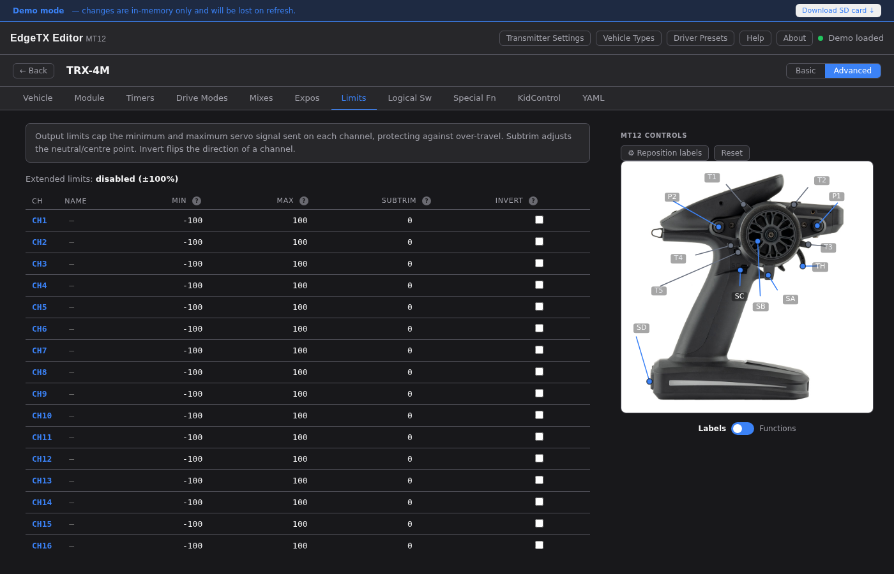

Limits set hard caps on the servo signal sent on each output channel, regardless of what the mixer produces.

| Setting | Description |
|---------|-------------|
| Min | Minimum servo output (default −100 = full reverse) |
| Max | Maximum servo output (default +100 = full forward) |
| Subtrim | Adjusts the neutral/centre point of the servo |
| Invert | Reverses the direction of the channel |
| PPM centre | The centre pulse width in microseconds (default 1500 µs) |

Use limits to prevent servo over-travel if the physical linkage cannot reach the full range.

---

## 12. Advanced View — Logical Switches

Logical switches are virtual switches you create from conditions. They can be used anywhere a physical switch can — in mix conditions, expo lines, or special functions.

### Adding a logical switch

Click **＋ Add** to create a new logical switch.

### Configuring a logical switch

Each row is one logical switch (L1, L2, …):

| Column | Description |
|--------|-------------|
| Function | The logic type — see below |
| Arg 1 / Arg 2 / Arg 3 | Inputs for the function |
| AND SW | An additional gate switch — the logical switch is only active when this is also active |
| Delay | Seconds to wait after condition becomes true before activating |
| Duration | Seconds to stay active after condition becomes false |

### Common functions

| Function | Behaviour |
|----------|-----------|
| Sticky | Latches ON when triggered; stays ON until reset (used for cruise control) |
| a=b / a≠b / a>b | Compares two values (channel outputs, pots, etc.) |
| AND / OR / XOR | Combines two other switches |
| Edge | Fires once on the rising edge of a switch |
| Timer | Pulses on a time interval |

---

## 13. Advanced View — Special Functions

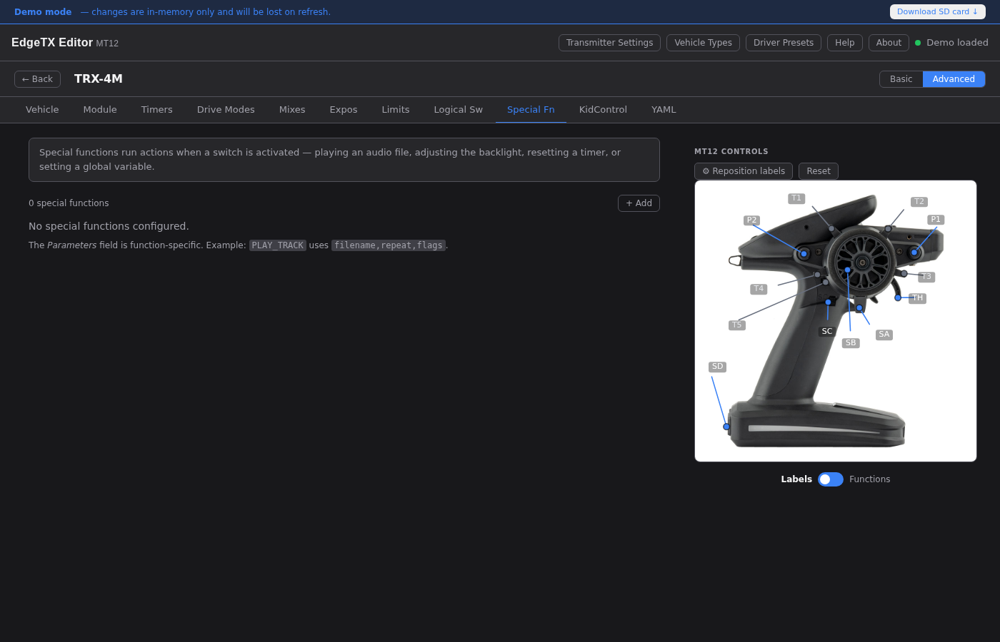

Special functions run an action when a switch is activated. They fire in real time on the transmitter.

| Column | Description |
|--------|-------------|
| Switch | The trigger — any physical or logical switch |
| Function | The action to perform |
| Parameter | Function-specific parameter (filename, value, etc.) |
| Repeat | Trigger once, or keep firing while the switch is active |
| Active | Enable/disable this row without deleting it |

### Common functions

| Function | Description |
|----------|-------------|
| Play track | Play an audio file from the SD card's `SOUNDS/` folder |
| Play value | Speak a channel value or variable out loud |
| Reset timer | Reset timer 1, 2, or 3 |
| Adjust GVar | Set or increment a global variable |
| Backlight | Turn the screen backlight on or off |
| SD logs | Start or stop telemetry logging to the SD card |

---

## 14. Advanced View — KidControl Tab

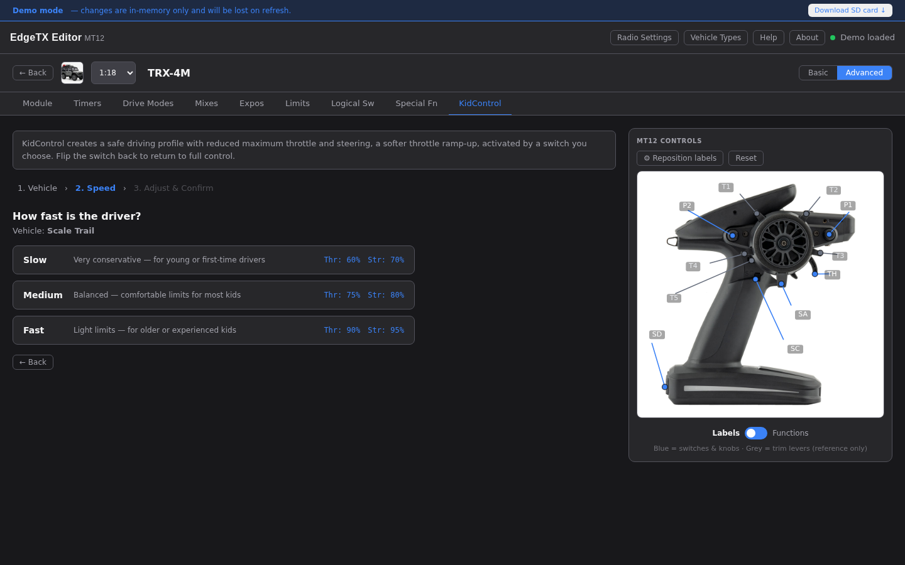

The KidControl tab shows the wizard directly when KidControl is not yet configured for this model. The three-step flow (vehicle type → speed class → sliders) is identical to the Basic view path — see [KidControl Wizard](#5-kidcontrol-wizard).

When **KidControl is active**, the tab shows a summary card:

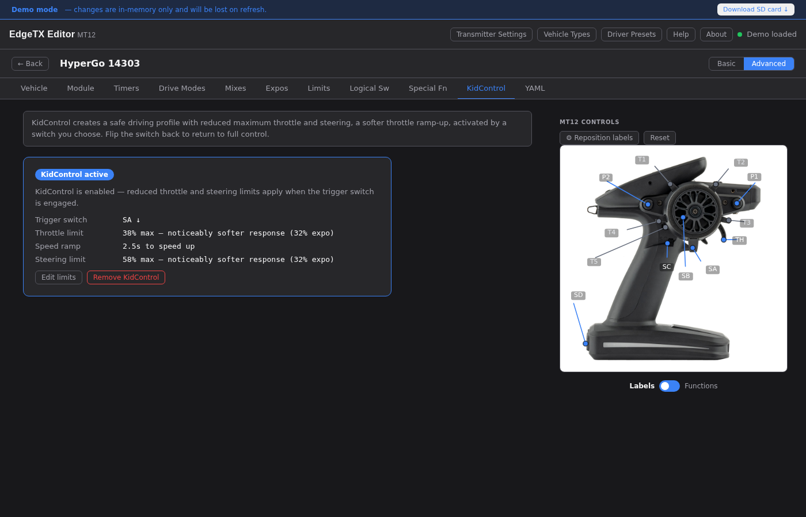

The summary shows:
- The trigger switch currently assigned (e.g. FL10)
- Throttle limit and expo settings
- Speed-up and speed-down ramp times
- Steering limit and expo settings
- A **Remove KidControl** button to delete the FM1 drive mode and all associated mix/expo lines

---

## 15. Transmitter Settings

Access Transmitter Settings from the **Transmitter Settings** button in the header.

> **Note:** Transmitter Settings requires an SD card (or demo) to be connected. The settings are read from and written to `RADIO/radio.yml` on the card.

Two buttons appear in the top bar when radio settings are loaded:

- **Backup** — writes a timestamped backup of the current radio settings to `BACKUP/`. Briefly shows "Backed up!" to confirm.
- **History** — opens the radio backup browser (greyed out if no radio backups exist). Lets you preview, restore, download, or delete radio backups.

### Audio tab

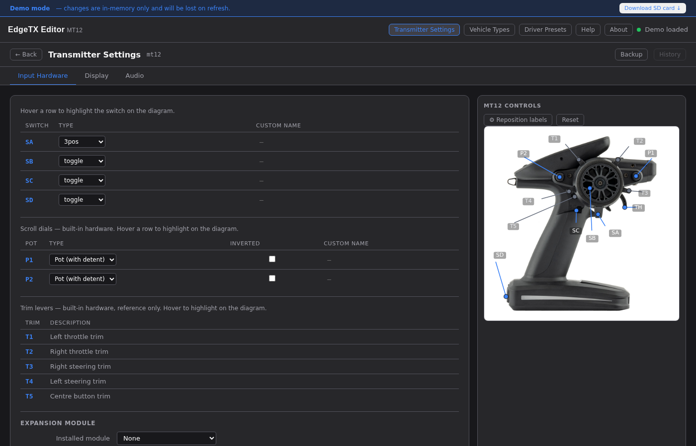

| Section | Settings |
|---------|---------|
| Volumes | Speaker volume, Beep volume, WAV volume, Vario volume, Background volume, Speaker pitch |
| Beep & Haptic | Beep mode (quiet/alarms/nokey/all), Beep length, Haptic mode, Haptic strength, Haptic length |

### Display tab

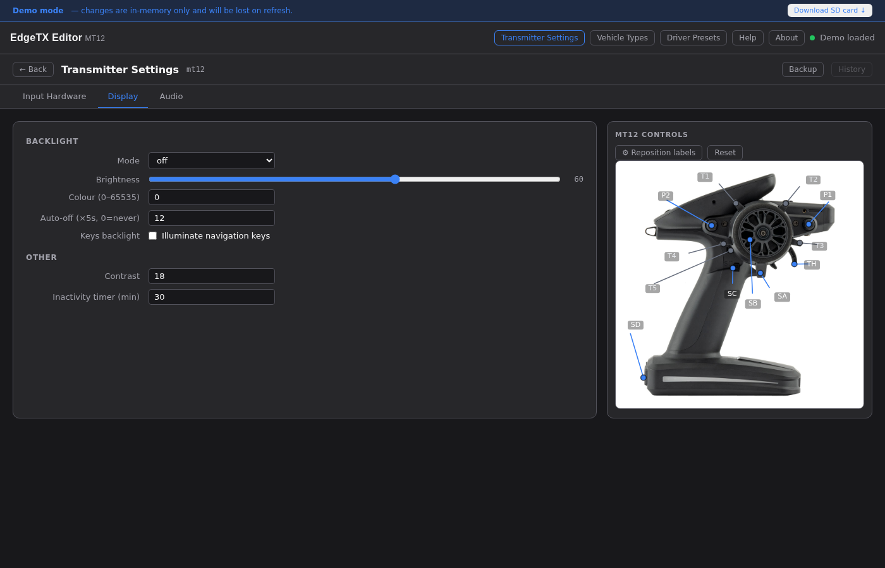

| Setting | Description |
|---------|-------------|
| Backlight mode | Off, Keys, Sticks, Keys+Sticks, Always on |
| Backlight delay | How long before the backlight turns off |
| Brightness | Screen brightness level |
| Contrast | Display contrast |

### Switches tab

Configure the **type** and **name** of each physical switch on the MT12:

| Switch | Default type | Notes |
|--------|-------------|-------|
| SA | 3-position | Centre position is middle |
| SB, SC, SD | 2-position toggle | Some may be momentary |
| FL1, FL2 | 2-position latching | |

Setting a meaningful name (e.g. "KID" for FL1 when used for KidControl) causes that name to appear on the transmitter screen and in the diagram labels.

### Pots tab

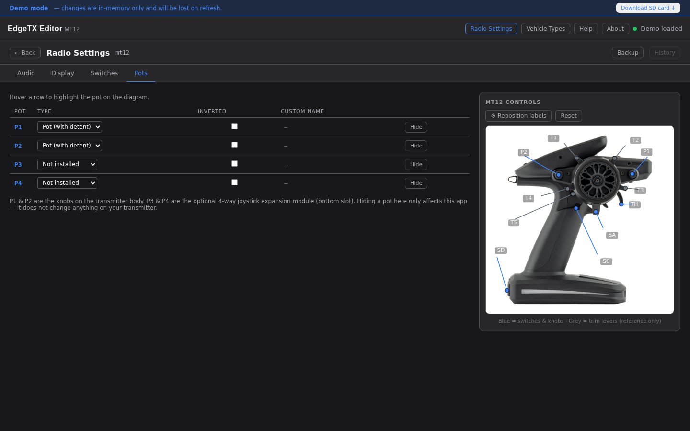

Configure the **type** and **name** of each pot (scroll wheel/knob):

| Pot | Default use |
|-----|-------------|
| P1 | Scroll wheel — typically steering trim or auxiliary |
| P2 | Scroll wheel with centre detent — speed limiter by default |
| P3 | Joystick X axis (if expansion module fitted) |
| P4 | Joystick Y axis (if expansion module fitted) |

### MT12 Controls diagram

The diagram on the right of the Transmitter Settings page shows the transmitter layout with your configured labels. Each control is annotated with its current name. Use **⚙ Reposition labels** to adjust label placement and **Reset** to restore defaults.

---

## 16. Vehicle Types

Access Vehicle Types from the **Vehicle Types** button in the header.

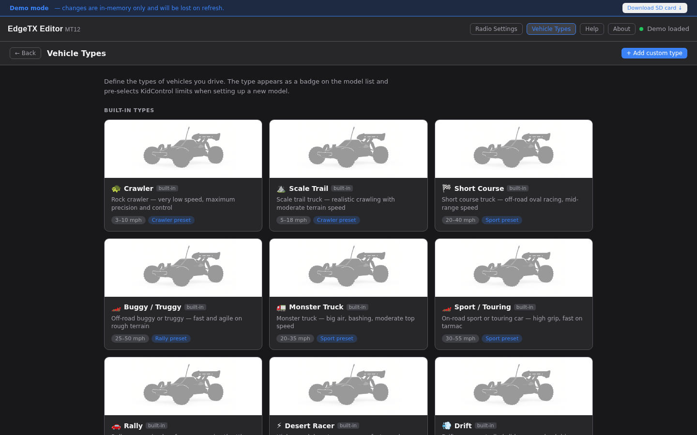

The Vehicle Types page manages the list of categories that appear in the model editor's **Vehicle details** section and in the KidControl wizard.

### Built-in categories

Nine categories are always available and cannot be deleted:

| Category | KidControl preset | Speed range |
|----------|------------------|-------------|
| 🐢 Crawler | Crawler | 3–8 mph |
| ⛰️ Scale Trail | Crawler | 5–18 mph |
| 🏁 Short Course | Sport | 25–55 mph |
| 🏎️ Buggy / Truggy | Rally | 35–65 mph |
| 🚛 Monster Truck | Sport | 20–45 mph |
| 🏎️ Sport / Touring | Sport | 30–60 mph |
| 🚗 Rally | Rally | 40–70 mph |
| ⚡ Desert Racer | High-speed | 55–90 mph |
| 💨 Drift | Sport | 20–50 mph |

The **KidControl preset** determines which set of default throttle and steering limits the KidControl wizard uses for that category.

### Custom categories

Click **＋ Add custom type** to create a custom vehicle category. Each category has:

| Field | Description |
|-------|-------------|
| Name | Display name shown in model cards and the wizard |
| Icon/image | An image uploaded from your computer, stored on the SD card |
| KidControl defaults | Pre-set throttle limit, steering limit, and expo values |

Custom categories are stored in `.webconfig/vehicle-categories.json` on the SD card — they travel with the card, not with individual model files.

---

## 17. Saving & Backup

### Saving with an SD card connected

Click **Save** (the blue button in the model editor top bar, visible when changes are unsaved) to write the current model to the SD card. Before writing, the app automatically creates a timestamped backup in the `BACKUP/` folder.

A model with unsaved changes shows an **Unsaved** badge in the editor top bar and a dot on its card in the model list.

### Saving without an SD card

If no SD card is connected, **Save** downloads the `.yml` file to your computer. Copy it to the SD card manually when ready.

### Unsaved changes guard

If you try to navigate away from a model with unsaved changes, the app shows a confirmation dialog:

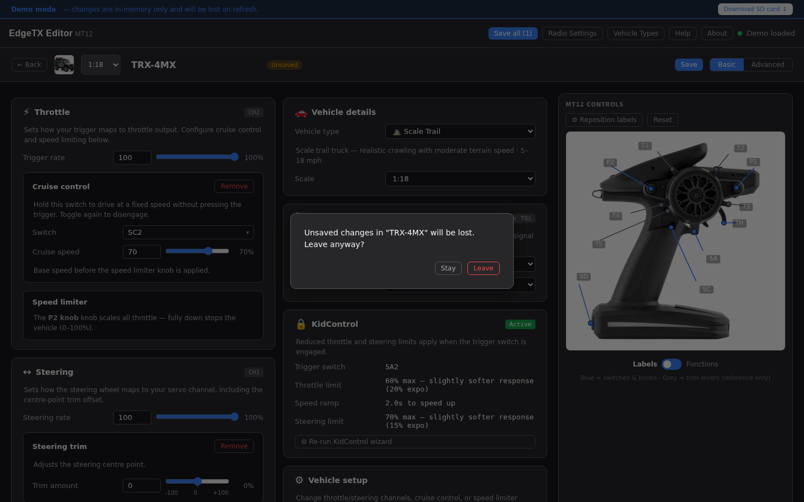

- **Stay** — return to the editor without losing changes
- **Save and leave** — save the model to the SD card, then navigate away
- **Discard and leave** — discard the unsaved changes and navigate away

The same dialog appears when navigating away from Transmitter Settings with unsaved changes.

### Manual backup

When an SD card or demo is connected, each model card shows a **Backup** button. Clicking it immediately writes a timestamped copy of the model to `BACKUP/` — useful before making risky edits. This captures what is currently on disk, not any in-memory unsaved changes.

### Backup browser

Both the **History** button (per model card) and **Manage backups** (model list toolbar) open the backup browser.

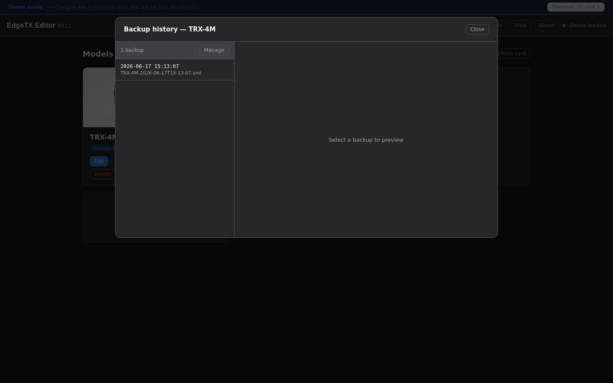

The browser has two panels:

**Left — backup list**

Lists timestamped backup files, sorted newest-first. In the **Manage backups** view (all-models), entries are grouped by model name — click a group header to expand it.

A **Manage** button switches into delete mode: checkboxes appear on every entry, **Select all** selects everything, and **Delete N** permanently removes selected backups after a single confirmation.

> **Backup retention** — the **Manage backups** panel shows a **Max backups per model** field at the top. The default is 15; the range is 1–50. Older backups beyond the limit are pruned automatically each time a model is saved.

**Right — preview and restore**

When you select a backup, the right panel shows:

| Control | Description |
|---------|-------------|
| **Restore to** | Dropdown to choose the target slot. Pick an existing slot to overwrite it, or **New slot** to load as a fresh model |
| **Diff** checkbox | When the target slot has an existing model, shows a line-by-line diff (green `+` lines only in backup; red `−` lines only in current). Untick to view raw YAML |
| **Download** | Downloads the backup file as `.yml` without restoring |
| **Restore** | Restores the backup into the chosen slot. The current version of the target model is itself backed up first |

> **Radio backups** — radio backups are managed via the **History** button on the Transmitter Settings page, not through the model backup browser.

### Restoring a deleted model

If a model has been deleted its card is gone, so the **History** button is no longer accessible. Use **Manage backups** in the model list toolbar to open the all-models backup browser. Select the backup, choose **New slot** (or an existing slot) in **Restore to**, and click **Restore**. The model loads as an unsaved draft — review it and click **Save** to write it back to the card.

---

## 18. Help & About

### Help

Click **Help** in the header to open the built-in user manual. A **Quick Links** section at the top provides links to the EdgeTX documentation and the official RadioMaster MT12 PDF manual.

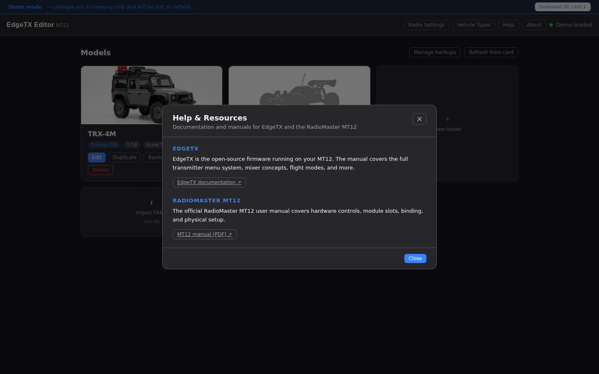

### About

Click **About** in the header to open the About dialog.

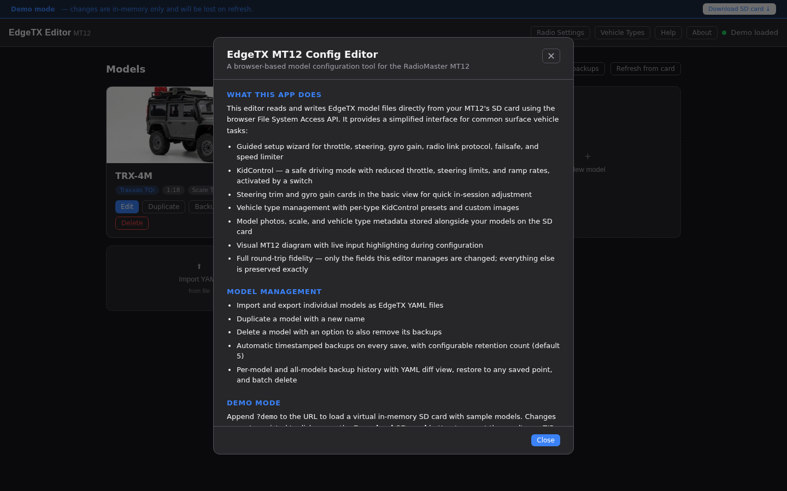

This covers:

- What the app does and doesn't do
- Demo mode usage
- The optional MT12 expansion module (joystick/buttons) and its current level of support
- Known limitations (no telemetry editor, no graphical curve editor, no trainer port config, etc.)
- Planned features on the roadmap

---

*For issues and feature requests, see the [GitHub repository](https://github.com/thurcombe/mt12-configurator).*
