# EdgeTX MT12 Config Editor — User Manual

A browser-based editor for creating and managing EdgeTX model configuration files on the Radiomaster MT12 surface transmitter.

---

## Table of Contents

1. [Getting Started](#1-getting-started)
2. [The Model List](#2-the-model-list)
3. [Basic View](#3-basic-view)
4. [Setup Wizard](#4-setup-wizard)
5. [KidControl Wizard](#5-kidcontrol-wizard)
6. [Advanced View — Module](#6-advanced-view--module)
7. [Advanced View — Timers](#7-advanced-view--timers)
8. [Advanced View — Drive Modes](#8-advanced-view--drive-modes)
9. [Advanced View — Mixes](#9-advanced-view--mixes)
10. [Advanced View — Expos](#10-advanced-view--expos)
11. [Advanced View — Limits](#11-advanced-view--limits)
12. [Advanced View — Logical Switches](#12-advanced-view--logical-switches)
13. [Advanced View — Special Functions](#13-advanced-view--special-functions)
14. [Advanced View — KidControl Tab](#14-advanced-view--kidcontrol-tab)
15. [Radio Settings](#15-radio-settings)
16. [Vehicle Types](#16-vehicle-types)
17. [App Settings](#17-app-settings)
18. [Saving & Backup](#18-saving--backup)
19. [Help & About](#19-help--about)

---

## 1. Getting Started

### Browser requirements

The app uses the browser [File System Access API](https://developer.mozilla.org/en-US/docs/Web/API/File_System_API) to read and write directly to your MT12's SD card. This requires:

- **Chrome 86+ or Edge 86+** for full SD card access
- Firefox and Safari work but fall back to downloading YAML files instead of writing directly to the card

### Connecting your SD card

1. Insert your MT12's SD card into your computer's card reader (or connect the MT12 via USB in mass storage mode)
2. Open the app in Chrome or Edge
3. Click **Connect SD card** in the top-right corner of the header
4. When the browser asks you to pick a folder, select the **root of the SD card** (the folder that contains `MODELS/`, `RADIO/`, `BACKUP/`)
5. The red dot in the header turns green and the model list populates

### Offline mode (no SD card)

You can use the app without an SD card. The banner at the top of the model list explains the difference: any **Save** will download the YAML file to your computer instead of writing to the card.

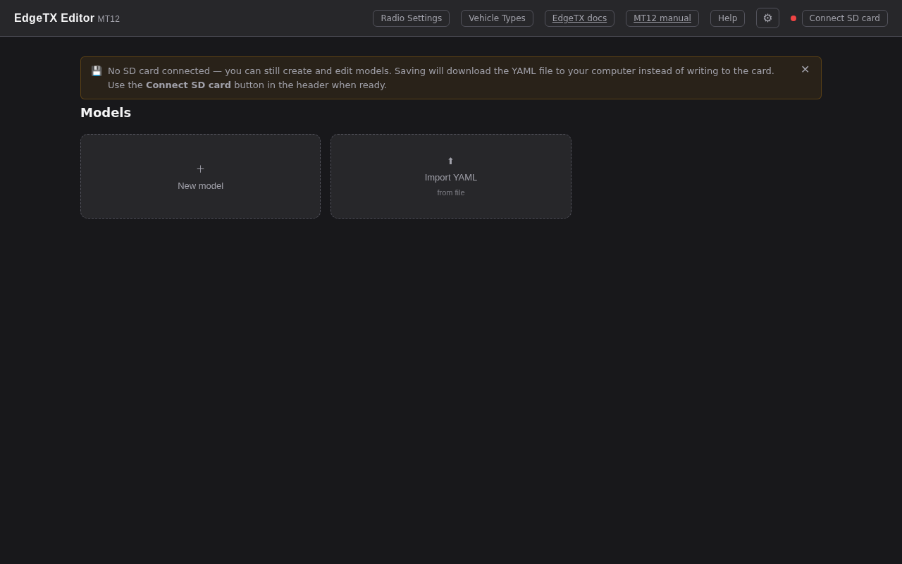

---

## 2. The Model List

The model list is the home screen. It shows every model loaded from the SD card (or created/imported in the current session).

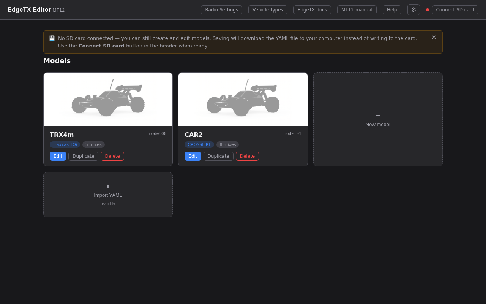

Each model card shows:

- **Model name** and slot number (e.g. `model00`)
- **Protocol badge** — the RF protocol this model uses (e.g. Traxxas TQi, CROSSFIRE)
- **Mix count** — number of active mix lines
- **Edit**, **Duplicate**, **Delete** action buttons
- **Backup** button (only shown when an SD card is connected) — immediately writes a timestamped backup of the current model to `BACKUP/`. The button briefly shows "Backed up!" to confirm the action completed.
- **History** button (only shown when an SD card is connected) — opens the backup browser for this model, with diff preview, download, restore-to-any-slot, and bulk delete

### Toolbar actions

When an SD card is connected, the toolbar above the model grid shows two additional buttons:

- **Manage backups** — opens the backup browser showing every backup file across all models and radio settings. Use this to restore any backup (including deleted models), delete stale entries, or download backup files.
- **Refresh from card** — reloads all model files from the SD card, discarding any in-memory changes.

### Creating a new model

Click the **＋ New model** card. This creates a blank model in the next available slot and immediately opens the model editor in Basic view, where the setup wizard walks you through the initial configuration.

### Importing an existing YAML file

Click the **⬆ Import YAML** card. A file picker opens — select a `.yml` or `.yaml` model file from anywhere on your computer. The model is imported and opened in the editor immediately.

### Deleting a model

Click **Delete** on any model card. A confirmation dialog appears before anything is removed.

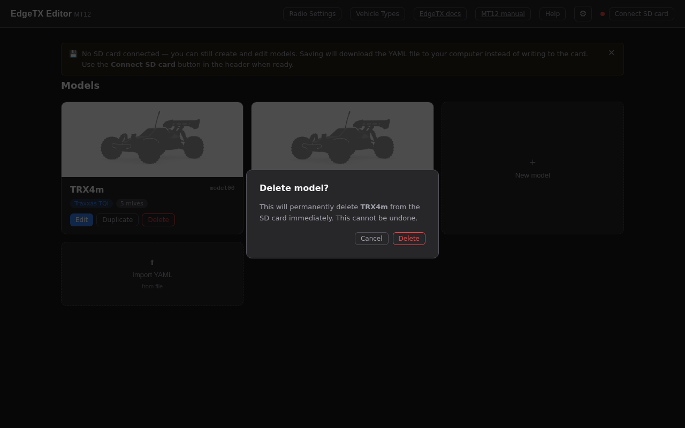

> **Warning:** When an SD card is connected, deletion removes the file from the card immediately. This cannot be undone.

---

## 3. Basic View

When you open a model in the editor it starts in **Basic** view — a simplified, task-oriented summary of the most commonly changed settings. Switch to **Advanced** in the top-right toggle when you need full access to all parameters.

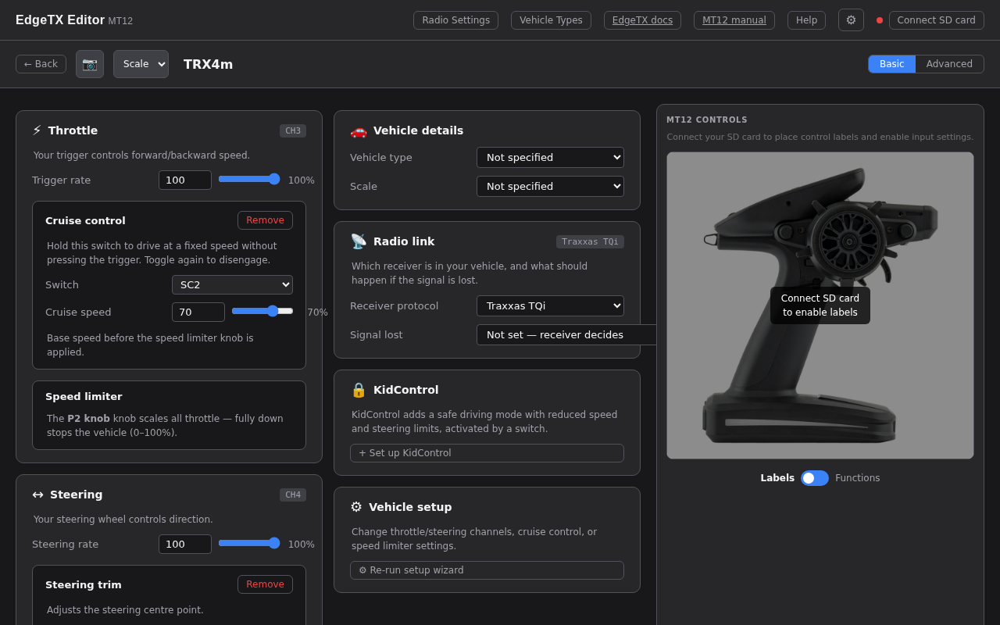

The basic view is divided into named sections on the left, and the **MT12 Controls** diagram on the right.

### Throttle

Shows which input drives your throttle channel and the current **Trigger rate** — the maximum throttle percentage (100% = full range, lower values reduce the top speed).

### Cruise control

A sticky switch that holds the current throttle level without pressing the trigger. You can configure:

- **Switch** — which physical switch engages cruise control
- **Cruise speed** — the base speed (as a percentage) the cruise hold is centred on

Click **Remove** to delete the cruise control mix entirely.

### Speed limiter

Shows the current speed limiter configuration. Two modes are available:

- **Variable** — a trim lever (T1–T5) or knob (P1/P2) scales throttle continuously. Moving the control to its minimum position stops the vehicle.
- **Switch** — a switch position cuts throttle to a fixed percentage. The limit only applies when the switch is in the configured position.

The speed limiter is always active unless removed via Advanced > Mixes.

### Steering

Shows which input drives your steering channel and the current **Steering rate** (maximum servo travel as a percentage).

### Steering trim

A trim mix applied on top of the steering input — adjusts the neutral/centre point of the steering. Click **Remove** to delete it.

### Vehicle details

- **Vehicle type** — links this model to one of your [Vehicle Types](#16-vehicle-types), which provides KidControl presets and an optional default image
- **Scale** — the 1:N scale of your RC vehicle (metadata only, stored on the SD card)

### Radio link

Displays the current receiver protocol (e.g. Traxxas TQi) and the **Signal lost** (failsafe) behaviour. Click through to [Module](#6-advanced-view--module) in Advanced view to change these.

### KidControl

Shows whether KidControl is active on this model. If not yet configured, click **＋ Set up KidControl** to launch the [KidControl Wizard](#5-kidcontrol-wizard).

### Vehicle setup

Click **Re-run setup wizard** to re-open the full setup wizard. This lets you change any configuration set during initial setup — channel assignments, protocol, failsafe, speed limiter, steering trim, and gyro gain — without going into Advanced view.

> When re-running the wizard on an existing model, all steps are pre-populated with the current model's values so you only need to change what you want.

### The MT12 Controls diagram

The right panel shows a photo of the MT12 with your controls labelled. When an SD card is connected and input labels have been configured in [Radio Settings](#15-radio-settings), each switch and pot is annotated.

Toggle **Labels / Functions** at the bottom to switch between showing the assigned names and the EdgeTX function names (SA, SB, P1, etc.).

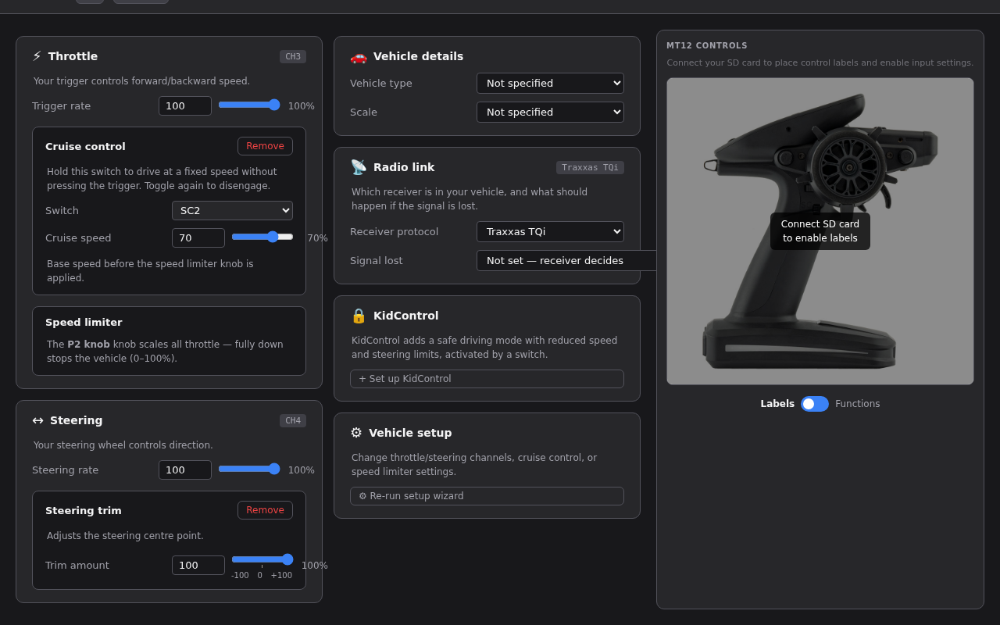

---

## 4. Setup Wizard

The setup wizard runs automatically when a new model is created, and can be re-run at any time via **Re-run setup wizard** in the Basic view. It walks through each major configuration area in turn, pre-filling values from the current model when re-running.

### Input pickers and diagram highlighting

Throughout the wizard, dropdown pickers for physical inputs (trim levers, knobs, switches) highlight the corresponding control on the **MT12 Controls diagram** as you hover over each option. This makes it easy to identify the right control without referring to the transmitter.

### Wizard steps

**Vehicle** — Set the model name, vehicle category, and scale. Selecting a vehicle category here also determines the KidControl preset defaults.

**Radio link** — Choose the RF protocol and failsafe behaviour.

**Throttle** — Assign the throttle channel and set the maximum trigger rate.

**Cruise control** — Optionally assign a switch for cruise hold and set a default cruise speed.

**Speed limiter** — Choose how throttle is limited:
- *None* — no speed limiter
- *Variable* — assign a trim lever (T1–T5) or knob (P1/P2) to scale throttle continuously
- *Switch* — assign a switch position that cuts throttle to a fixed percentage

**Steering** — Assign the steering channel, set the steering rate, and optionally choose a **steering trim** source. The trim source is a trim lever (T1–T5) or knob that adjusts the steering neutral point. T1–T5 are rocker-style trim buttons — each press steps the trim value up or down.

**Gyro gain** — Optionally assign a trim lever (T1–T5) or knob to control gyro sensitivity on a dedicated channel.

**KidControl** — Optionally launch the [KidControl Wizard](#5-kidcontrol-wizard) as the final step.

**Done** — Review a summary of all settings and click **Apply** to generate the model's mix and expo lines.

---

## 5. KidControl Wizard

KidControl creates a safe driving profile activated by a physical switch on the transmitter. When the switch is engaged, reduced throttle and steering limits apply — flip the switch back to return to normal control.

The wizard opens from the **Basic view** when you click **＋ Set up KidControl** in the KidControl section, or from the **KidControl tab** in Advanced view.

### Step 1 — Vehicle type

> **This step is skipped automatically** if the model already has a vehicle type set (configured in the Basic view Vehicle details section or during initial setup). The wizard jumps straight to step 2 using the saved type.

If no vehicle type is set, the wizard shows the full list of vehicle categories from your [Vehicle Types](#16-vehicle-types) page. Choosing a category here saves it to the model's metadata so future wizard runs skip this step.

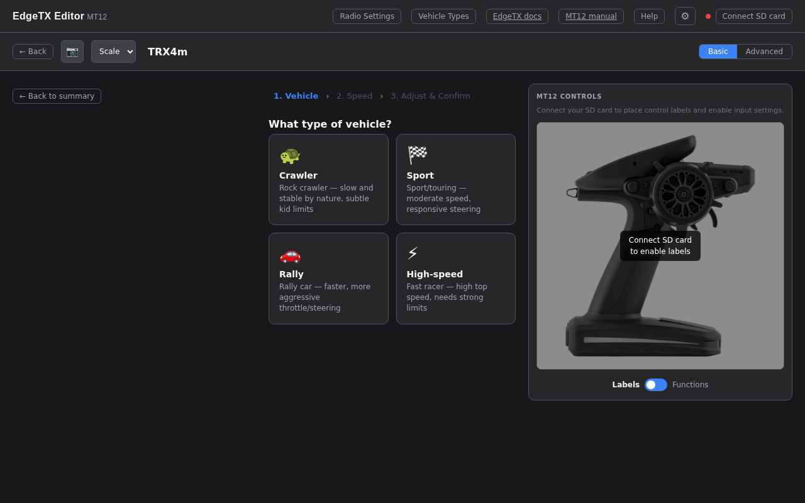

Each category maps to one of four KidControl presets (Crawler, Sport, Rally, High-speed) that determine the default throttle and steering limits in step 3. The mapping is shown on the Vehicle Types page.

Clicking a category immediately advances to step 2.

### Step 2 — Speed class

Choose how conservative the limits should be for the driver.

| Option | Description |
|--------|-------------|
| Slow | Very conservative — for young or first-time drivers |
| Medium | Balanced — comfortable limits for most kids |
| Fast | Light limits — for older or experienced kids |

Clicking a speed class immediately advances to step 3.

### Step 3 — Adjust & Confirm

The final step presents all the derived parameters as adjustable sliders, with a live description of what each setting means in practice.

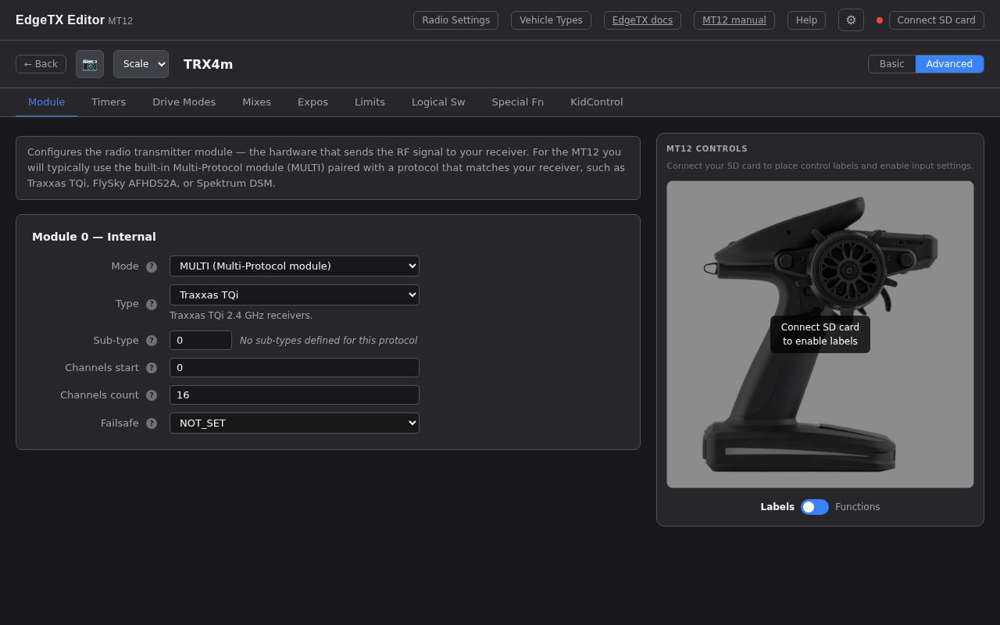

Parameters you can adjust:

| Parameter | What it controls |
|-----------|-----------------|
| Throttle limit | Maximum throttle as a percentage of full power |
| Throttle expo | How soft the centre of the trigger feels |
| Speed-up ramp | How many seconds it takes to reach full throttle |
| Slow-down ramp | How many seconds it takes to release throttle fully |
| Steering limit | Maximum steering servo travel as a percentage |
| Steering expo | How soft the steering feels near centre |

You also choose which **switch** activates KidControl (defaults to FL1-0).

Click **Apply** to write the KidControl configuration to the model. Click **← Back to summary** at any time to cancel without changing anything.

---

## 6. Advanced View — Module

Switch to **Advanced** view using the toggle in the top-right of the model editor. The editor shows a row of tabs; the default tab is **Module**.

The Module tab configures the RF transmitter hardware that sends the signal to your receiver.

### Internal module

| Setting | Description |
|---------|-------------|
| Protocol | The RF protocol — must match your receiver. Common surface choices: Traxxas TQi, Traxxas TQ Gen2, DSM2, DSMX, FlySky AFHDS2A |
| Sub-type | Protocol variant (where applicable) |
| Channels | How many channels to transmit (typically 8) |
| Failsafe mode | What the receiver does when the signal is lost: No pulses, Hold last position, or Custom |
| RX number | Receiver binding number — change when binding a new receiver |

### External module

The MT12 also has an external module bay (SMA connector). Configure a second RF module here if fitted.

---

## 7. Advanced View — Timers

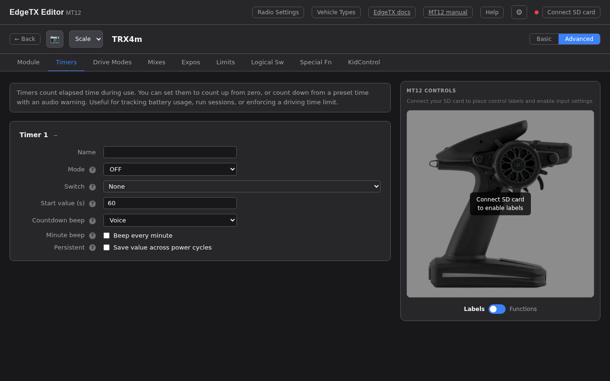

The MT12 supports up to three independent timers. Each can be configured with:

| Setting | Description |
|---------|-------------|
| Mode | Off, absolute (counts up), countdown, countdown with beep |
| Name | Short label shown on the transmitter screen |
| Start time | For countdown timers: the time to count down from |
| Switch | Pause/resume the timer with this switch (leave blank to run always) |
| Minute beep | Beep every minute |
| Countdown beep | Beep in the last 30/20/10 seconds |
| Persistent | Remember the timer value across power cycles |

Timers are useful for tracking battery run time, session duration, or enforcing driving time limits.

---

## 8. Advanced View — Drive Modes

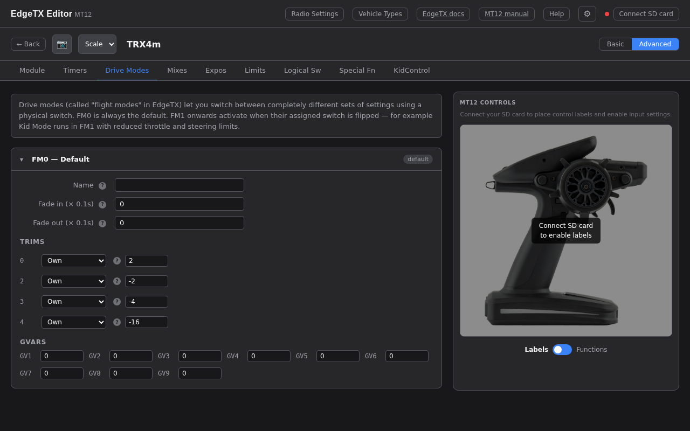

Drive modes (called *flight modes* in EdgeTX) let you switch between completely different sets of channel behaviour using a physical switch. **FM0 is always the default** and is always active when no other mode is engaged.

Each mode has:

| Setting | Description |
|---------|-------------|
| Name | Short label (up to 10 characters) |
| Switch | Which switch activates this mode (leave blank for FM0) |
| Fade in / out | How many tenths of a second to crossfade into/out of this mode |
| Trims | Per-trim override: use own trim, use FM0's trim, or disable |

KidControl uses **FM1** as its safe-mode slot. When the KidControl switch is engaged, FM1 activates and the KidControl expo and mix lines take effect.

---

## 9. Advanced View — Mixes

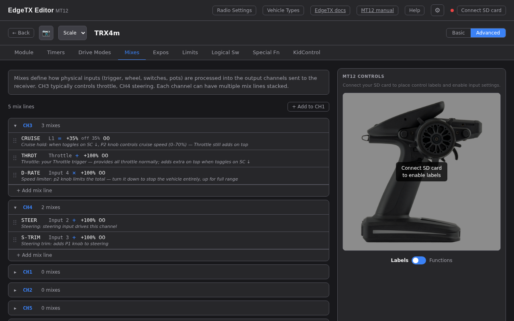

Mixes define how physical inputs are processed into the output channels sent to your receiver. The view groups mix lines by output channel (CH1, CH2, etc.) and shows each line's source, weight, and a human-readable description.

- **CH3** typically controls throttle
- **CH4** typically controls steering

### Adding a mix line

Click **＋ Add to CHn** inside a channel group to add a new mix line on that channel.

### Editing a mix line

Click on any mix line row to open the edit form with the full set of parameters:

| Parameter | Description |
|-----------|-------------|
| Source | The physical input (trigger, wheel, switch, pot, other channel, etc.) |
| Weight | How much of the source is mixed in (positive = same direction, negative = inverted) |
| Offset | A constant offset added to the mix output |
| Multiply / Replace / Add | How this line combines with other lines on the same channel |
| Switch | Only apply this mix when this switch is active |
| Flight modes | Which drive modes this mix is active in |
| Speed up / down | Ramp rate in tenths of a second |
| Delay up / down | Activation delay in tenths of a second |
| Name | Optional label (shown in the mix list) |

### Reordering mix lines

Drag a mix line by its handle to reorder it within a channel group. Order matters when mode is **Add** or **Multiply** — lines are applied top to bottom.

---

## 10. Advanced View — Expos

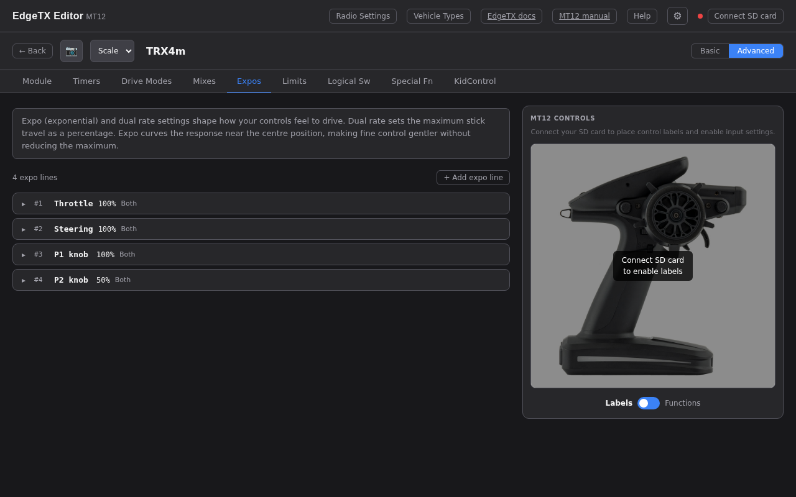

Expo (exponential) and dual rate lines shape how physical inputs feel to drive, without changing the maximum output.

Each line applies to one input channel (steering, throttle, etc.) and has:

| Parameter | Description |
|-----------|-------------|
| Channel | The input to shape (steering, throttle, etc.) |
| Mode | Both directions, positive only, negative only |
| Dual rate (weight) | Maximum travel as a percentage of full. 100% = no reduction. 70% = 30% reduced maximum |
| Expo | Curve the response near centre. 0 = linear. Positive values make the centre softer |
| Switch | Only apply when this switch is active |
| Flight modes | Which drive modes this line is active in |
| Name | Optional label |

Multiple expo lines can be stacked on the same input — the active line is selected by switch or drive mode.

---

## 11. Advanced View — Limits

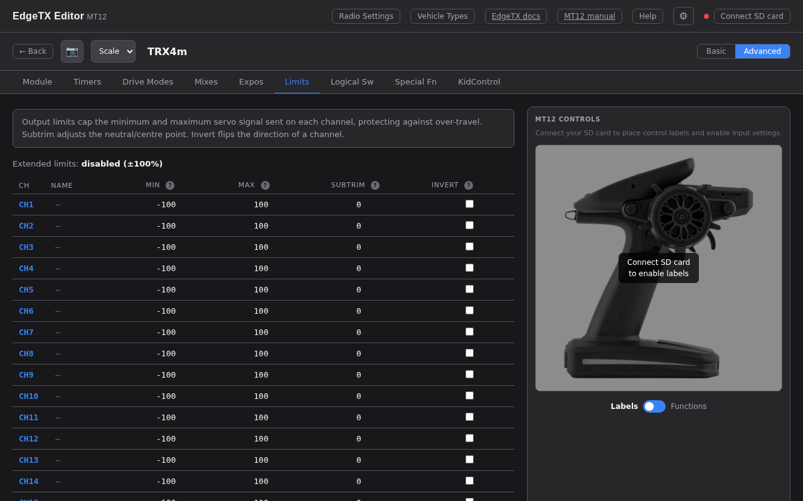

Limits set hard caps on the servo signal sent on each output channel, regardless of what the mixer produces.

| Setting | Description |
|---------|-------------|
| Min | Minimum servo output (default −100 = full reverse) |
| Max | Maximum servo output (default +100 = full forward) |
| Subtrim | Adjusts the neutral/centre point of the servo |
| Invert | Reverses the direction of the channel |
| PPM centre | The centre pulse width in microseconds (default 1500 µs) |

Use limits to prevent servo over-travel if the physical linkage cannot reach the full range.

---

## 12. Advanced View — Logical Switches

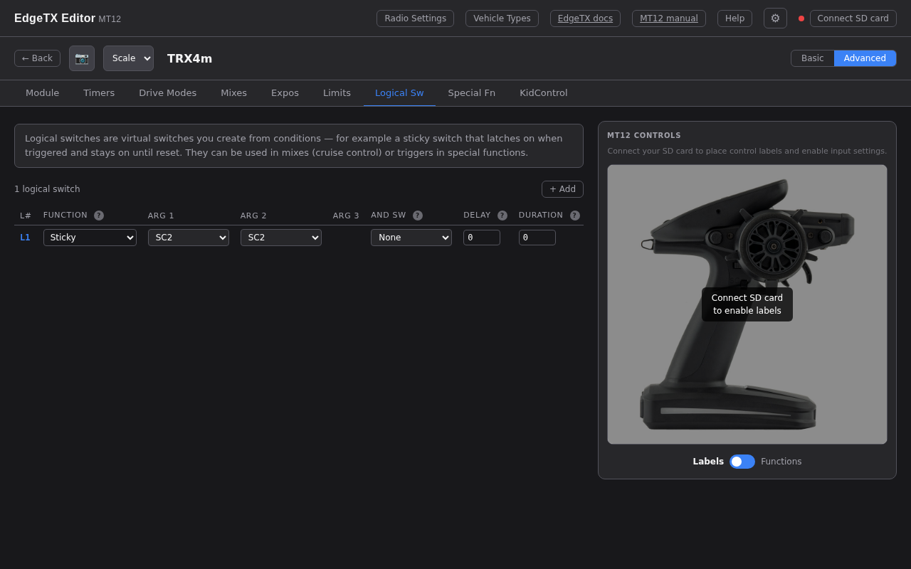

Logical switches are virtual switches you create from conditions. They can be referenced anywhere a physical switch can be used — in mix conditions, expo lines, or special functions.

### Adding a logical switch

Click **＋ Add** to create a new logical switch.

### Configuring a logical switch

Each row is one logical switch (L1, L2, …) with:

| Column | Description |
|--------|-------------|
| Function | The logic type — see below |
| Arg 1 / Arg 2 / Arg 3 | Inputs for the function |
| AND SW | An additional gate switch — the logical switch is only active when this switch is also active |
| Delay | Seconds to wait after condition becomes true before activating |
| Duration | Seconds to stay active after condition becomes false |

### Common functions

| Function | Behaviour |
|----------|-----------|
| Sticky | Latches ON when triggered; stays ON until reset (great for cruise control) |
| a=b / a≠b / a>b | Compares two values (channel outputs, pots, etc.) |
| AND / OR / XOR | Combines two other switches |
| Edge | Fires once on the rising edge of a switch |
| Timer | Pulses on a time interval |

---

## 13. Advanced View — Special Functions

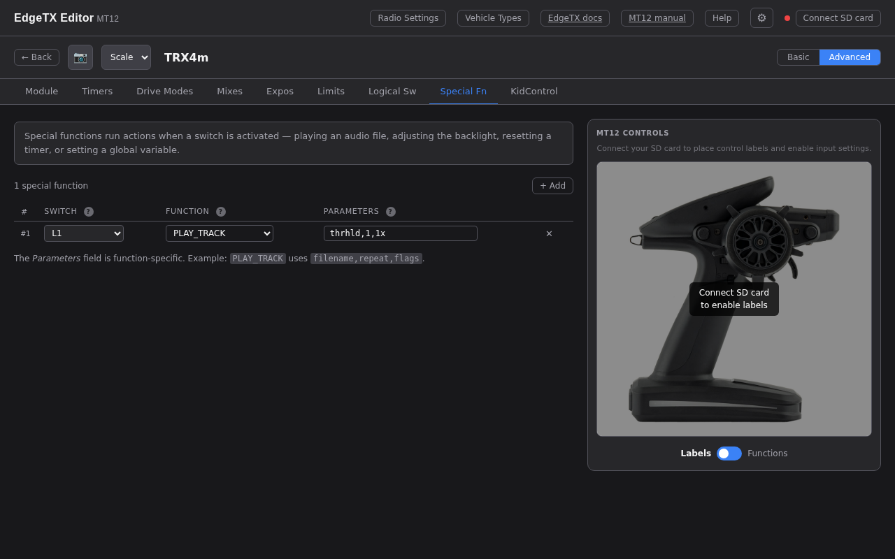

Special functions run an action when a switch is activated. They fire in real time on the transmitter.

Each row has:

| Column | Description |
|--------|-------------|
| Switch | The trigger — any physical or logical switch |
| Function | The action to perform — see below |
| Parameter | Function-specific parameter (filename, value, etc.) |
| Repeat | Trigger once, or keep firing while the switch is active |
| Active | Enable/disable this row without deleting it |

### Common functions

| Function | Description |
|----------|-------------|
| Play track | Play an audio file from the SD card's `SOUNDS/` folder |
| Play value | Speak a channel value or variable out loud |
| Reset timer | Reset timer 1, 2, or 3 |
| Adjust GVar | Set or increment a global variable |
| Backlight | Turn the screen backlight on or off |
| SD logs | Start or stop telemetry logging to the SD card |

---

## 14. Advanced View — KidControl Tab

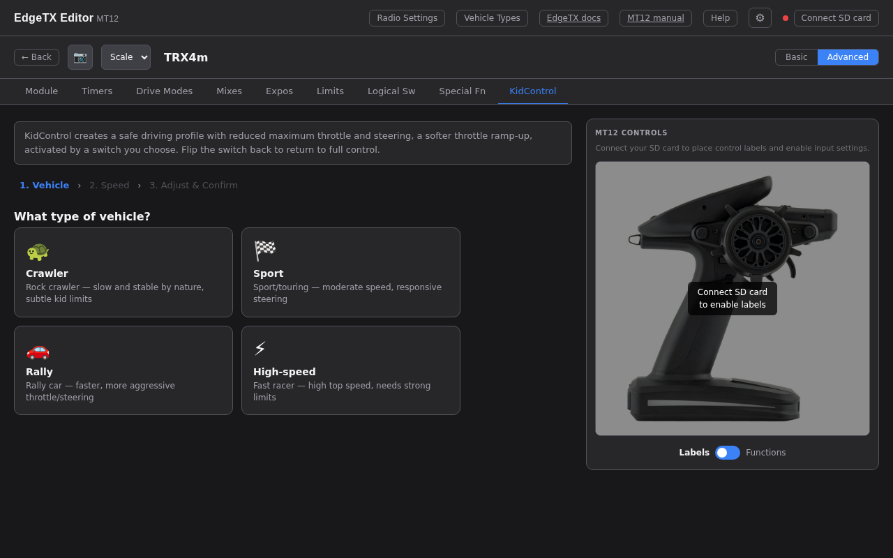

The KidControl tab in Advanced view gives access to the same wizard and active-configuration summary as the Basic view, but within the tabbed Advanced layout.

When **KidControl is not yet configured**, it shows the three-step wizard (vehicle type → speed class → sliders).

When **KidControl is active**, it shows a summary card with:

- The trigger switch currently assigned
- Throttle limit and expo settings
- Steering limit and expo settings
- Throttle ramp-up and ramp-down times
- A **Reconfigure** button to re-run the wizard with new values
- A **Remove KidControl** button to delete the FM1 drive mode and all associated KidControl mix/expo lines

---

## 15. Radio Settings

The Radio Settings page configures transmitter-global options — audio, display, and switch/pot labelling. Access it from the **Radio Settings** button in the header.

> **Note:** Radio Settings requires an SD card to be connected. The settings are stored in `RADIO/radio.yml` on the card.

Two buttons appear in the top bar when an SD card is connected and radio settings are loaded:

- **Backup** — writes an immediate timestamped backup of the current radio settings to `BACKUP/`. The button briefly shows "Backed up!" to confirm.
- **History** — opens the radio backup browser (grayed out if no radio backups exist yet). From there you can preview, restore, download, or delete radio backups. Restore loads the backup into memory and marks radio settings as unsaved — click **Save** to write it back to the card.

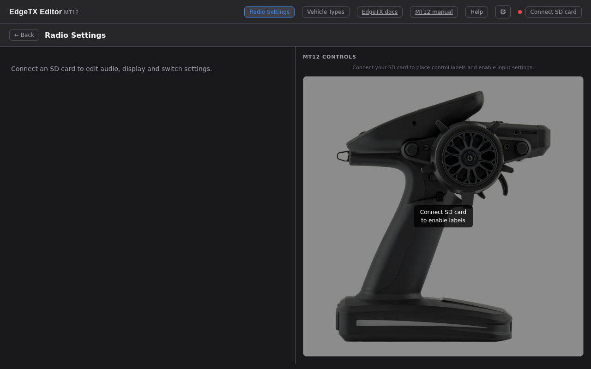

### Audio

| Setting | Description |
|---------|-------------|
| Beep volume | Volume for key-press beeps and alerts |
| WAV volume | Volume for audio file playback (special functions) |
| Vario volume | Volume for variometer audio (if applicable) |
| Background volume | Volume for background music |
| Speaker pitch | Tone pitch for beep sounds |

### Display

| Setting | Description |
|---------|-------------|
| Backlight mode | Off, Keys, Sticks, Keys+Sticks, Always on |
| Backlight delay | How long before the backlight turns off |
| Brightness | Screen brightness level |
| Colour | Screen colour theme (where supported) |

### Switches

Configure the **type** and **name** of each physical switch on the MT12:

| Switch | Default type | Notes |
|--------|-------------|-------|
| SA | 3-position | Centre position is middle |
| SB, SC, SD | 2-position toggle | Some may be momentary |
| FL1, FL2 | 2-position latching | |

Setting a meaningful name (e.g. "KID" for FL1 if used for KidControl) causes that name to appear on the transmitter screen and in the diagram labels.

### Pots

Configure the **type** and **name** of each pot (scroll wheel/knob):

| Pot | Use |
|-----|-----|
| P1 | Scroll wheel — typically steering trim or auxiliary |
| P2 | Scroll wheel with centre detent — speed limiter by default |
| P3 | Joystick X axis (if expansion module fitted) |
| P4 | Joystick Y axis (if expansion module fitted) |

### MT12 Controls diagram

The diagram on the right of the Radio Settings page shows the transmitter layout with your configured labels. Clicking a control in the diagram scrolls to its configuration section.

---

## 16. Vehicle Types

The Vehicle Types page lets you manage the list of vehicle types that appear in the model editor's **Vehicle details** section and in the KidControl wizard.

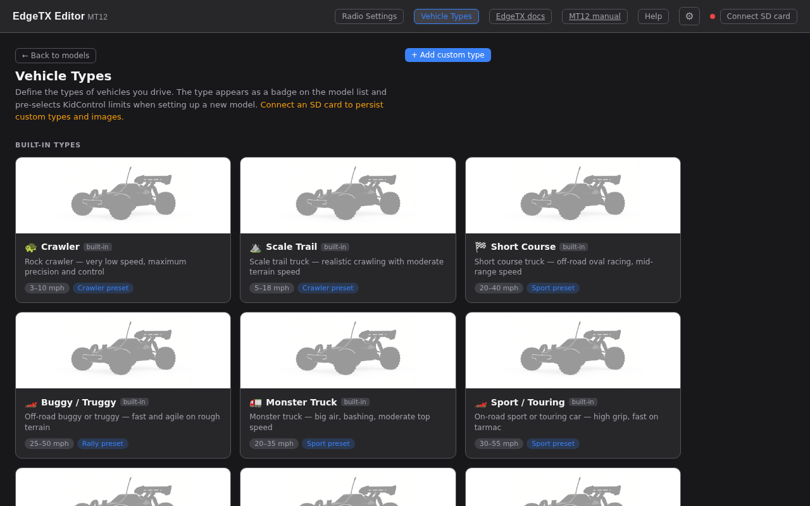

### Built-in categories

Nine categories are always available and cannot be deleted:

| Category | Description | KidControl preset |
|----------|-------------|-------------------|
| 🐢 Crawler | Rock crawler — very low speed, maximum precision | Crawler |
| ⛰️ Scale Trail | Scale trail truck — realistic crawling | Crawler |
| 🏁 Short Course | Short course truck — off-road oval racing | Sport |
| 🏎️ Buggy / Truggy | Off-road buggy or truggy — fast and agile | Rally |
| 🚛 Monster Truck | Monster truck — big air, bashing | Sport |
| 🏎️ Sport / Touring | On-road sport or touring car | Sport |
| 🚗 Rally | Rally car — mixed surface, aggressive throttle | Rally |
| ⚡ Desert Racer | High-speed desert racer — very fast | High-speed |
| 💨 Drift | Drift car — controlled slides, rear-wheel drive | Sport |

The **KidControl preset** column shows which set of default limits the KidControl wizard uses for that category.

### Custom categories

Click **＋ Add type** to create a custom vehicle category. Each category has:

| Field | Description |
|-------|-------------|
| Name | Display name shown in model cards and the wizard |
| Icon/image | An image uploaded from your computer, stored on the SD card |
| KidControl defaults | Pre-set throttle limit, steering limit, and expo values for the KidControl wizard |

Custom categories are stored in `.webconfig/vehicle-categories.json` on the SD card — they travel with the card, not with individual model files.

---

## 17. App Settings

Click the **⚙** icon in the header to open App Settings.

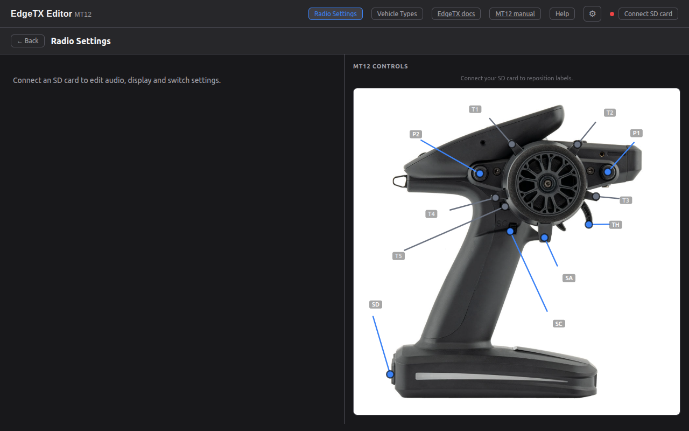

| Setting | Description |
|---------|-------------|
| Max backups per model | How many backup copies to keep per model in `BACKUP/` on the SD card. Older backups are pruned automatically when this limit is exceeded. Default: 5 |

Settings are saved to `.webconfig/app-settings.json` on the SD card when one is connected, and to the browser's `localStorage` when offline.

---

## 18. Saving & Backup

### Saving with an SD card connected

Click **Save** (the blue button in the model editor top bar) to write the current model to the SD card. Before writing, the app automatically creates a timestamped backup in the `BACKUP/` folder.

Click **Save All** (in the app header, visible when any model has unsaved changes) to save every dirty model in one action.

A model with unsaved changes shows an **Unsaved** badge in the editor top bar and a dot on its card in the model list.

### Saving without an SD card

If no SD card is connected, **Save** downloads the `.yml` file to your computer. You can then copy it to the card manually.

### Unsaved changes guard

If you try to navigate away from a model with unsaved changes, the app shows a confirmation dialog.

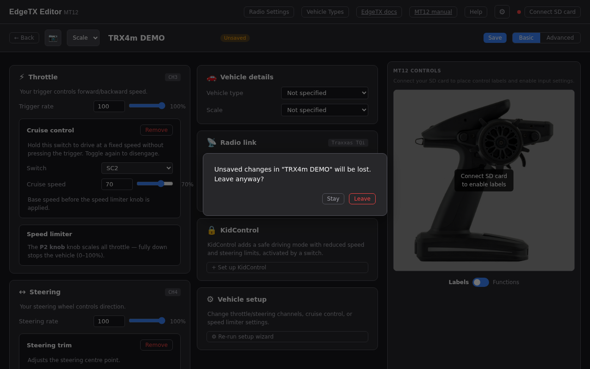

- **Stay** — return to the editor without losing changes
- **Leave** — discard the unsaved changes and navigate away

### Manual backup

When an SD card is connected, each model card shows a **Backup** button. Clicking it immediately writes a timestamped copy of the current model to the `BACKUP/` folder — useful before making risky edits, or when you want a named checkpoint without saving. This does not affect the **Unsaved** dirty state; it captures what is currently on disk, not any in-memory changes.

### Backup browser

Both the **History** button (per model card) and the **Restore backup** toolbar button open the same backup browser. It has two panels:

**Left — backup list**

Lists timestamped backup files, sorted newest-first.

In the **Manage backups** view (opened from the model list toolbar), entries are grouped by model name. Each group is collapsed by default — click a group header to expand it and see that model's individual backups.

A **Manage** button at the top of the sidebar switches into delete mode: checkboxes appear on every entry, a **Select all** checkbox at the top selects or deselects everything, and a **Delete N** button appears when entries are checked. Clicking **Delete N** asks for a single confirmation before permanently removing all selected backups. Click **Done** to exit delete mode.

**Right — preview and restore**

When you select a backup the right panel shows:

| Control | Description |
|---------|-------------|
| **Restore to** | Dropdown to choose the destination slot. Pick any existing model slot to overwrite it, or pick **New slot** to load the backup as a fresh model in the next available slot. |
| **Diff** checkbox | When the target slot contains an existing model, tick this to see a line-by-line diff (green `+` lines exist only in the backup; red `−` lines exist only in the current version). Untick to view the raw YAML. |
| **Download** | Downloads the backup file as a `.yml` file to your computer without restoring it. |
| **Restore** | Restores the backup into the chosen slot. The current version of the target model is itself backed up first. In the per-model history view, the dialog closes after restore; in the all-models view it stays open so you can restore multiple backups. Not available for radio backups — see below. |

A summary bar below the controls shows the count of added and removed lines when diffing.

> **Radio backups** — radio backups do not appear in the model backup browser. Manage them via the **History** button on the Radio Settings page.

### Restoring a deleted model

If a model has been deleted its card is gone, so the **History** button is no longer accessible. Use the **Manage backups** button in the model list toolbar instead. This opens the backup browser in all-models mode, showing every backup file across all models. Select the backup, confirm it looks correct in the preview or diff, choose **New slot** (or an existing slot to overwrite) in the **Restore to** dropdown, then click **Restore**. The model loads as an unsaved draft — review it and click **Save** to write it back to the card.

---

## 19. Help & About

Click the **Help** button in the header to open the About dialog.

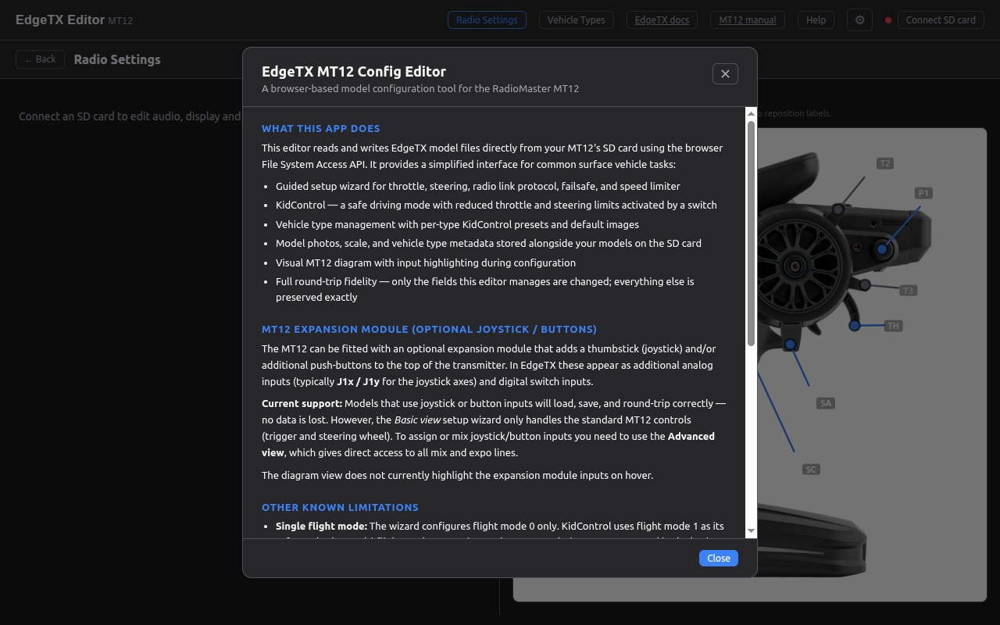

This covers:

- What the app does and doesn't do
- The optional MT12 expansion module (joystick/buttons) and its current level of support
- Known limitations (no telemetry editor, no graphical curve editor, no trainer port config, etc.)
- Planned features on the roadmap

---

*For issues and feature requests, see the [GitHub repository](https://github.com/thurcombe/mt12-configurator).*
